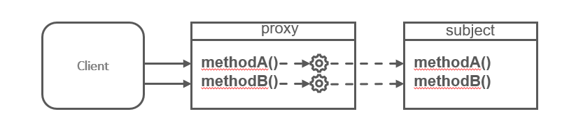
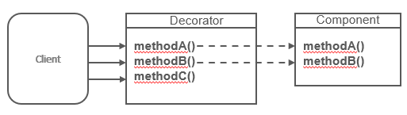
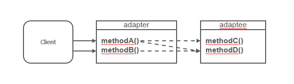

# Part 4: Node.js avanced patterns and techniques
## Chapter 34 &mdash; Structural Design Patterns
> Design patterns for building more complex, flexible and reusable structures through the combination of objects

### Contents
+ Introduce the set of traditional design patterns for the realization of relationships between entities
+ The **Proxy** pattern
+ The **Decorator** pattern
+ The **Adapter** pattern
+ Introducing the basis of *reactive programming (RP)* concepts
+ Introducing *LevelDB* for Node.js ecosystem

### Proxy
> A **Proxy** is an object that controls access to another object, called the *subject*. A *proxy* intercepts all or some of the operations that are meant to be executed on the *subject*, augmenting or complementing its behavior.

The *proxy* and the subject have an identical interface, and this allows us to swap one for the other transparently.

| NOTE: |
| :---- |
| An alternative name for the *proxy* pattern is **surrogate**. |



The *proxy* forwards each operation to the subject, enhancing its behavior with additional preprocessing or postprocessing.

It's important to notice that the *Proxy* pattern involves wrapping an actual instance of the subject, not its class &mdash; the internal state of the object is thus preserved.

A *proxy* is useful in the following circumstances:
* data validation &mdash; it gives you a chance to validate the input before forwarding it to the subject.
* security &mdash; the *proxy* can verify that the client is authorized to perform the operation.
* caching &mdash; the *proxy* can keep an internal cache and only execute the operation on the subject if the data is not yet present in the cache.
* lazy initialization &mdash; if creating the subject is expensive, the proxy can delay its initialization until it is necessary.
* logging &mdash; the *proxy* can intercept the method invocation and record the parameters.
* remote objects &mdash; the *proxy* can be used to make a remote object appear local to consumers.

#### Techniques for implementing proxies

When *proxying* an object, we can decide to intercept all of its methods or only some of them, while delegating the rest directly to the subject. In this section we will explore many different ways we can achieve this.

Our *subject* will be a simple `StackCalculator` class. The class provides methods for multiplication and division. We will want to *proxy* the instances of this class to enhance it by providing a more conservative behavior for division (in JavaScript n/0 renders `Infinity` instead of an exception).

```javascript
export class StackCalculator {
  constructor() {
    this.stack = [];
  }

  putValue(value) {
    this.stack.push(value);
  }

  getValue() {
    return this.stack.pop();
  }

  peekValue() {
    return this.stack[this.stack.length - 1];
  }

  clear() {
    this.stack = [];
  }

  divide() {
    const divisor = this.getValue();
    const dividend = this.getValue();
    const result = dividend / divisor;
    this.putValue(result);
    return result;
  }

  multiply() {
    const multiplier = this.getValue();
    const multiplicand = this.getValue();
    const result = multiplicand * multiplier;
    this.putValue(result);
    return result;
  }
}
```

##### Object composition

*Composition* is a technique whereby an object is combined with another object for the purpose of extending or using its functionality.

In the specific case of the *Proxy* pattern, a new object with the same interface as the subject is created, and a reference to the subject is stored internally in the procy in the form of an instance variable or closure variable.

The *subject* can then be injected from the client at creation time or created by the *proxy* itself.

Let's see it in action creating a `SafeCalculator` class that proxies the `divide()` method on the `StackCalculator` class to intercept the *divide by zero* situation.

The remaining operations will be simply delegated to the `StackCalculator` class:

```javascript
export class SafeCalculator {
  constructor(calculator) {
    this.calculator = calculator;
  }

  /* proxied method */
  divide() {
    const divisor = this.calculator.peekValue();
    if (divisor === 0) {
      throw Error('Division by 0');
    }
    return this.calculator.divide();
  }

  /* delegated methods */
  putValue(value) {
    return this.calculator.putValue(value);
  }

  getValue() {
    return this.calculator.getValue();
  }

  peekValue() {
    return this.calculator.peekValue();
  }

  clear() {
    return this.calculator.clear();
  }

  multiply() {
    return this.calculator.multiply();
  }
}
```


Note that to implement the proxy using composition, we had to intercept the method we were interested in manipulating, while simply delegating the rest of them to the *subject*. Note also that the interface for the *proxy* and the *subject* is identical.

Another interesting fact is that the proxy does not maintain the underlying calculator state.

The consumer of the proxy will have to do:

```javascript
const calculator = new StackCalculator();
const safeCalculator = new SafeCalculator(calculator);

safeCalculator.putValue(0);
safeCalculator.putValue(0);
console.log(safeCalculator.divide());
```

| EXAMPLE: |
| :------- |
| See [01 &mdash; *Proxy* pattern: Object composition](01-proxy-object-composition) for a runnable example. |


Note that you can also implement the *Proxy* pattern using object composition with a *Factory* function that returns an object literal, rather than using classes as in the example above:

```javascript
export function createSafeCalculator(calculator) {
  return {
    /* proxied method */
    divide() {
      const divisor = calculator.peekValue();
      if (divisor === 0) {
        throw Error('Division by 0');
      }
      return calculator.divide();
    },

    /* delegated methods */
    putValue(value) {
      return calculator.putValue(value);
    },

    getValue() {
      return calculator.getValue();
    },

    peekValue() {
      return calculator.peekValue();
    },

    clear() {
      return calculator.clear();
    },

    multiply() {
      return calculator.multiply();
    }
  };
}
```

| EXAMPLE: |
| :------- |
| See [02 &mdash; *Proxy* pattern: Object composition with object literals](02-proxy-object-composition-object-literal) for a runnable example. |


Note that having to delegate many methods for complex classes can be very tedious and make it harder to implement.

##### Object augmentation

*Object augmentation* (or *monkey patching) is probably the simplest and most common way of proxying just a few methods of an object. It involves modifying the subject directly by replacing a method with its proxied implementation.

```javascript
export function patchToSafeCalculator(calculator) {
  const divideOriginal = calculator.divide;
  calculator.divide = () => {
    const divisor = calculator.peekValue();
    if (divisor === 0) {
      throw new Error('Division by 0');
    }
    return divideOriginal.apply(calculator);
  };
  return calculator;
}
```

In this technique, we only need to implement the methods on which we need add some logic. For the remaining ones, we return the original calculator.

| NOTE: |
| :---- |
| The `apply(thisArg, [argsArray])` method of the `Function` object calls a function with a given `this` and arguments. |

| EXAMPLE: |
| :------- |
| See [03 &mdash; *Proxy* pattern: *Monkey patching* technique](03-proxy-monkey-patching) for a runnable example. |

This technique is very succinct and convenient but comes at the cost of mutating the *subject* object, which can be dangerously. This can have unintended consequences when the *subject* is shared with other parts of the codebase.

> The *monkey patching* technique for creating proxies is only recommended for *subjects* that exist in a controlled context or in a private scope, as the original behavior is changed, and there might be parts of the application that rely in the original behavior.


##### The built-in `Proxy` object

The built-in `Proxy` object defined in the ES2015 standard introduced a native way to create powerful proxy objects.

```javascript
const proxy = new Proxy(target, handler);
```

+ `target` &mdash; represents the *subject*.
+ `handler` &mdash; is a special object that defines the behavior of the proxy.

The `handler` object contains a series of optional methods with predefined names called *trap methods* (`apply`, `get`, `set`, `has`...) that are automatically called when the corresponding operations are performed on the proxy instance.

```javascript
export const safeCalculatorHandler = {
  get: (target, property) => {
    if (property === 'divide') {
      /* proxied method */
      return function () {
        const divisor = target.peekValue();
        if (divisor === 0) {
          throw new Error('Division by zero');
        }
        return target.divide();
      };
    }

    /* delegated methods and properties */
    return target[property];
  }
};
```

Note how we use the `get` trap to intercept access to properties and methods in the object, so that we could safely patch the `divide()` method while delegating the remaining operations to the original object.

The `Proxy` object inherits the prototype of the *subject*, so that `safeCalculator instanceOf StackCalculator` will return true.

| EXAMPLE: |
| :------- |
| See [04 &mdash; *Proxy* pattern: using the built-in `Proxy` object](04-proxy-built-in-proxy) for a runnable example. |

###### Additional capabilities and limitations of the `Proxy` object

The `Proxy` object can also be utilized to implement features such as *meta-programming*, *operator overloading*, and *object virtualization*.

Let's elaborate these ideas in a very succinct example:

```javascript
const evenNumbers = new Proxy([], {
  get: (target, index) => index * 2,
  has: (target, number) => number % 2 === 0
});

console.log(2 in evenNumbers);
console.log(5 in evenNumbers);
console.log(evenNumbers[7]);
```

| EXAMPLE: |
| :------- |
| See [05 &mdash; Capabilities of the `Proxy` object](05-built-in-proxy-capabilities) for a runnable example. |

In the example, we are creating a virtual array that contains all the even numbers. Note that it can be used as a regular array, which means we can access its elements using `[]` as in `evenNumbers[7]`, or even check the existence of a given number in the array using `in` as in `2 in evenNumbers`.

In the example, the `get` trap is used to intercept the access to the array element, returning the even number for the given index. The `has` trap intercepts the usage of the `in` operator.

| NOTE: |
| :---- |
| You can deep dive in all the capabilities of the `Proxy` object on [MDN](https://developer.mozilla.org/en-US/docs/Web/JavaScript/Reference/Global_Objects/Proxy). |

##### A comparison of the different proxying techniques

+ *Composition* &mdash; simple and safe, as it leaves the subject untouched. The only drawback is that it might get a little tedious when you're proxying a complicated class and you're delegating many of the *subject*'s methods.
+ *Object augmentation (monkey patching)* &mdash; it is succinct, but it is never a good idea to mutate the *subject*. It is a good solution when the *subject* is under control, and you only want to proxy a few methods.
+ `Proxy` &mdash; provides a very robust approach if you need to intercept function calls or have different types of access to object attributes.

#### Example: *Proxying* a Writable stream
In this section, we will apply the *Proxy* pattern to a real example by building an object that acts as a proxy to a *Writable* stream.

The *proxy* will intercept all the calls to the `write()` method and will log a message every time this happens.

We will use the `Proxy` object technique to implement this proxy:

```javascript
export function createLoggingWritable(writable) {
  return new Proxy(writable, {
    get(target, propKey) {
      if (propKey === 'write') {
        return function (...args) {
          const [ chunk ] = args;
          console.log(`Writing`, chunk);
          return writable.write(...args);
        };
      }
      return target[propKey];
    }
  });
}
```

The main points of the implementation are:
+ we create a *factory* that returns a proxied version of the `writable` object passed as an argument.
+ we use the `get(...)` trap to intercept access to the object properties.
+ we check if the property accessed is the `write(...)` method. If that is the case, we return the function that should be executed instead of the original behavior.
+ that function uses `...args` to collect in an array all the arguments that are passed to that function, and then extract the `chunk` parameter, as this will be the one we want to use for logging.
+ Then, we log the chunk received and invoke the original behavior of the *writable* stream.
+ Finally, if the property or method accessed had nothing to do with the `write(...)` method, we just delegate the call to the underlying writable.

Using this module is extremely simple:

```javascript
import { createWriteStream } from 'fs';
import { createLoggingWritable } from './lib/logging-writable.js';

const writable = createWriteStream('test.txt');
const writableProxy = createLoggingWritable(writable);

writableProxy.write('first chunk.');
writableProxy.write('second chunk.');
writable.write('third chunk: this will not be logged.');
writableProxy.end();
```


| EXAMPLE: |
| :------- |
| See [06 &mdash; *Proxy* pattern: building a *proxy* on a *Writable* stream](06-proxy-writable-stream) for a runnable example. |

#### *Change Observer* pattern with Proxy

*Proxies* are also effective tools to create observable objects.

> The **Change Observer** pattern is a design pattern in which an object (the *subject*) notifies one or more observers of any state change in the object so that they can *react* to changes as soon as any change occur.

| NOTE: |
| :---- |
| Although very similar, the **Change Observer** pattern should not be confused with the **Observer** pattern we discussed while learning about callbacks and events. The latter is a more generic approach that adopts an event emitter to propagate information about events happening in the system. See [**Observer** pattern](../chapter29-callbacks-and-events/README.md#the-observer-pattern) for a reminder on the concepts backing the pattern. |

The implementation is quite succinct:

```javascript
export function createObservable(target, observer) {
  const observable = new Proxy(target, {
    set(obj, prop, value) {
      if (value !== obj[prop]) {
        const prev = obj[prop];
        obj[prop] = value;
        observer({ prop, prev, curr: value });
      }
      return true;
    }
  });
  return observable;
}
```

+ We create a *factory* function that accepts the object to observe for changes, and a function `observer(...)` that will be invoked every time a change is detected.
+ In the function, we create a `Proxy` object that implements the `set(...)` trap to detect every time a property is set.
+ In the implementation, we check if a change has been made, and if that is the case, we invoke the `obserser(...)` function with the property, previous and current value.
+ We make the `set(...)` trap return `true` no matter whether the change was detected or not.
+ Finally, we return the *proxy* object we have created and configured.


Using the `observable` is very easy as well:

```javascript
import { createObservable } from './lib/create-observable.js';

function calculateTotal(invoice) {
  return invoice.subtotal - invoice.discount + invoice.tax;
}

const invoice = {
  subtotal: 100,
  discount: 10,
  tax: 20
};

let total = calculateTotal(invoice);
console.log(`Starting total: ${ total }`);

const observableInvoice = createObservable(invoice, ({ prop, prev, curr }) => {
  total = calculateTotal(invoice);
  console.log(`TOTAL: ${ total } (${ prop } changed: ${ prev } => ${ curr })`);
});

observableInvoice.subtotal = 200; // subtotal updated
observableInvoice.discount = 20;  // discount updated
observableInvoice.discount = 20;  // no change: smart change detection!
observableInvoice.tax = 15;       // tax updated
```

In the example, we define an `invoice` object literal that keeps track of a subtotal, discount and tax associated with an invoice.

We also define a function `calculateTotal()` that computes the final amount of the invoice.

Then we apply the *Change Observer* pattern, using the `createObservable()` *factory*: the target object will be the `invoice` object, and the `observer(...)` function is in charge of updating the total amount for the invoice, and logging in the console what change has been detected.

| EXAMPLE: |
| :------- |
| See [07 &mdash; *Change Observer* pattern: using a *proxy* to create an observable object](07-proxy-change-observer) for a runnable example. |

| NOTE: |
| :---- |
| The example above is a very simplistic implementation of the **Change Observer** pattern that illustrates the concept behaind the pattern. A more sophisticated implementation should use more traps to detect other types of mutations such as field deletions, changes in the prototype, etc. Also, the implementation does not recursively create proxies for nested objects or arrays. |

*Observables* are the cornerstone of *reactive programming (RP)* and *functional reactive programming (FRP)*. You can learn more about these techniques in the [*Reactive Manifesto*](https://www.reactivemanifesto.org/).

#### In the wild

The *Proxy* pattern and more specifically, the *Change Observer* pattern are widely adopted patterns which can be found in a multitude of projects and libraries:
+ [LoopBack](https://loopback.io/index.html) &mdash; uses the *Proxy* pattern to provide the capability to intercept and enhance method calls on controllers, which can be used to build custom validation or authentication mechanisms.

### Decorator

> **Decorator** is a structural design pattern aim to dynamically augment the behavior of an existing object.

It's different from inheritance, because not all instances of the class are augmented &mdash; the behavior is added only the classes that are explicitly augmented.

The following diagram depicts the idea behind the *Decorator* pattern:



See how the *Decorator* object is extending the *Component* object by adding a method. The existing methods are typically delegated to the decorated object without further processing, although in some cases, they might also be intercepted and augmented with extra behaviors.

Implementation wise, it is very similar to the *Proxy* pattern.

#### Techniques for implementing decorators

Although *proxy* and *decorator* are conceptually two different patterns, they share the same implementation techniques.

In the examples, we will use our `StackCalculator` class and we will decorate it to add a new method `add()`, and we will also intercept the `divide()` calls to detect the *divide by zero* situations and throw an exception instead of returning `Infinity`.

##### Composition

Using composition, the decorated component is wrapped around a new object. The decorator simply needs to define the new methods and delegate the existing ones to the component:

```javascript
export class EnhancedCalculator {
  constructor(calculator) {
    this.calculator = calculator;
  }

  /* new method */
  add() {
    const addend2 = this.getValue();
    const addend1 = this.getValue();
    const result = addend1 + addend2;
    this.putValue(result);
    return result;
  }

  /* modified method */
  divide() {
    const divisor = this.calculator.peekValue();
    if (divisor === 0) {
      throw Error('Division by zero');
    }

    return this.calculator.divide();
  }

  /* delegated methods */
  putValue(value) {
    return this.calculator.putValue(value);
  }

  getValue() {
    return this.calculator.getValue();
  }

  peekValue() {
    return this.calculator.peekValue();
  }

  clear() {
    return this.calculator.clear();
  }

  multiply() {
    return this.calculator.multiply();
  }
}
```

In the constructor we create a property to store the *component* we're decorating, and then use it for the methods for which we change the behavior or delegate.

Besides, a new method `add()` is exposed.

The consumers of the class can use this `EnhancedCalculator` in the usual way:

```javascript
import { StackCalculator } from './lib/stack-calculator.js';
import { EnhancedCalculator } from './lib/enhanced-calculator.js';

const calculator = new StackCalculator();
const enhancedCalculator = new EnhancedCalculator(calculator);

enhancedCalculator.putValue(4);
enhancedCalculator.putValue(3);
console.log(enhancedCalculator.add());

enhancedCalculator.putValue(2);
console.log(enhancedCalculator.multiply());
```

| EXAMPLE: |
| :------- |
| See [08 &mdash; *Decorator* pattern: using object composition](08-decorator-object-composition) for a runnable example. |

##### Object augmentation
*Object decoration* can also be achieved by simply attaching new methods directly to the decorated object (using the *monkey patching* technique):

```javascript
export function patchCalculator(calculator) {
  /* new method */
  calculator.add = () => {
    const addend2 = calculator.getValue();
    const addend1 = calculator.getValue();
    const result = addend1 + addend2;
    calculator.putValue(result);
    return result;
  };

  /* modified method */
  const originalDivide = calculator.divide;
  calculator.divide = () => {
    const divisor = calculator.peekValue();
    if (divisor === 0) {
      throw Error('Division by 0');
    }

    return originalDivide.apply(calculator);
  };

  return calculator;
}
```

Note that the original object is mutated, which is discouraged, but in contrast, the methods we don't change are automatically delegated to the underlying object without requiring any additional code.

| EXAMPLE: |
| :------- |
| See [09 &mdash; *Decorator* pattern: using *monkey patching* (object augmentation)](09-decorator-monkey-patching) for a runnable example. |

##### Decorating with the Proxy object

It's possible to implement object decoration using the `Proxy`object:

```javascript

export const enhancedCalculatorHandler = {
  get(target, property) {
    /* new method */
    if (property === 'add') {
      return function add() {
        const addend2 = target.getValue();
        const addend1 = target.getValue();
        const result = addend1 + addend2;
        target.putValue(result);
        return result;
      };
    } else {
      /* modified method */
      if (property === 'divide') {
        return function () {
          const divisor = target.getValue();
          if (divisor === 0) {
            throw new Error('Division by 0');
          }
          // delegate if not dividing by zero
          return target.divide();
        };
      }
    }

    /* delegated methods */
    return target[property];
  }
};
```

The implementation requires no explanation, with the `Proxy` object providing a very elegant way to add methods, augment existing ones and delegate to the ones we preserve as is:

```javascript
import { StackCalculator } from './lib/stack-calculator.js';
import { enhancedCalculatorHandler } from './lib/enhanced-calculator-handler.js';

const calculator = new StackCalculator();
const enhancedCalculator = new Proxy(calculator, enhancedCalculatorHandler);
```

| EXAMPLE: |
| :------- |
| See [10 &mdash; *Decorator* pattern: using `Proxy` object](chapter34-structural-design-patterns/10-decorator-proxy-object) for an example. |


| NOTE: |
| :---- |
| The same advantages and disadvantages that exist for the different implementation techniques for proxies apply to the *Decorator* implementation techniques: *Composition* is simple and safe, *Monkey-patching* is succinct but it mutates the *Component* object, and the *Proxy* object provides a very elegant way to implement *Decorators*. |

#### Decorating a LevelUP database

In the next section we'll deal with [`LevelUP`](https://www.npmjs.com/package/levelup) module &mdash; a Node.js wrapper around Google's *LevelDB*.

*LevelDB* is a key-value store originally built to implement IndexedDB in the Chrome browser. It is a very minimalist yet extensible database which makes it a perfect fit for Node.js purposes.

`LevelUP` has evolved from a simple *LevelDB* wrapper to support several kinds of backends, from in-memory stores to other NoSQL database such as Riak and Redis, to web storage endinges such as IndexedDB and `localStorage`, allowing us to use the same API both on the server and the client.

The vast ecosystem of plugins have made this database to provide complete database products on top of it (like [PouchDB](https://www.npmjs.com/package/pouchdb), a clone of CouchDB), or a graph database that works both on Node.js database and the browser. You can learn more about the vast *LevelUP* ecosystem in https://github.com/Level/awesome.


##### Implementing a LevelUP plugin

In the next example, we are going to create a *LevelUP* plugin using the *Decorator* pattern implemented with the *object augmentation (monkey-patching)* technique.

For convenience, we are going to use the [`level`](https://www.npmjs.com/package/level) package which bundles both `LevelUP` and the default adapter called `leveldown`, which uses *LevelDB* as the backend.

The idea is to build a plugin for *LevelUP* that will allow us to receive notifications every time an object with a certain pattern is saved into the database. For example, if we subscribe to a pattern such as `{ a: 1 }`, we want to receive a notification when objects such as `{ a: 1, b: 3}` or `{ a: 1, c: x }` are saved into the database.

In order to do that, let's build our plugin by creating a new module called `level-subscribe.js`:

```javascript
export function levelSubscribe(db) {
  db.subscribe = (pattern, listener) => {
    db.on('put', (key, val) => {
      /* array.every() checks whether all elements in the array pass the test */
      const match = Object.keys(pattern).every(k => (pattern[k] === val[k]));
      if (match) {
        listener(key, val);
      }
    });
  };
  return db;
}
```

The implementation consists in defining a `levelSubscribe(...)` function that will return a decorated `db` object that we receive as argument:
+ We decorate the `db` object received as argument with a `subscribe()` method that is attached directly on the instance (thus, monkey-patching/object augmentation technique).
+ We listen for any `'put'` events emitted from the `db` object when objects are recorded on the LevelUP database.
+ We validate that all the patterns sent to the `db.subscribe(...)` method are found in the object to be recorded, and if the condition is satisfied, then we invoke the `listener(...)` with the record that has been stored so that further actions can be carried out.

Usage is quite straightforward:

```javascript
import { dirname, join } from 'path';
import { fileURLToPath } from 'url';
import level from 'level';
import { levelSubscribe } from './lib/level-subscribe.js';

const __dirname = dirname(fileURLToPath(import.meta.url));

const dbPath = join(__dirname, 'db');
const db = level(dbPath, { valueEncoding: 'json' });
levelSubscribe(db);

db.subscribe({ doctype: 'tweet', language: 'en' }, (key, val) => console.log(val));

db.put('1', { doctype: 'tweet', text: 'Hi', language: 'en' });
db.put('2', { doctype: 'company', name: 'XYZ corp' });
```

Firs we initialize our *LevelUP* database, by selecting the directory where files backing the database are going to be stored, and the default encoding scheme for the contents.

Then, we attach our plugin calling `levelSubscribe(db)` &mdash; this will monkey-patch the original `db` object, adding the `subscribe(...)` method tht is not part of the original object-

Then, we register a listener for the object with pattern `doctype: 'tweet', language: 'en'`. All the objects matching those properties will be sent to the listener which just prints the value of the object in the console.

Finally, we save a couple of records in the DB: one that will trigger the subscription mechanism, and one that won't.

| EXAMPLE: |
| :------- |
| See [11 &mdash; *Decorator* pattern: creating a `LevelUP` plugin using object augmentation (monkey-patching)](11-decorator-level-up-plugin-monkey-patching) for a runnable example. |

#### In the wild

Despite simple, the real-world applications of the *Decorator* pattern make it a very useful and powerful pattern.

You can find many *LevelUP* plugins that leverage the same pattern:
+ [`level-inverted-index`](https://github.com/dominictarr/level-inverted-index) &mdash; which adds support for inverted indexes to a *LevelUP* database, to be able to perform efficient text searches across the values.
+ [`levelplus`](https://github.com/eugeneware/levelplus) &mdash; which adds support for atomic updates to a *LevelUP* database.

Also, you will find many other modules that make use of the *Decorator* outside of the *LevelUP* plugin ecosystem:
+ [`json-socket`](https://www.npmjs.com/package/json-socket) &mdash; facilitates sending JSON data over TCP by decorating `net.Socket`.
+ [`fastify`](https://www.fastify.io/) &mdash; web appliction framework that exposes an API to decorate a server instance with additional functionality or configuration.

### The line between proxy and decorator

The previous sections have elaborated about the definition and implementation of the *Proxy* and *Decorator* pattern. It should be clear by now that the boundaries between them are mostly conceptual:
+ *Proxy* pattern is used to control access to a concrete or virtual object. It does not change the original interface, so you should be able to pass a proxy instance where the original object was expected.
+ *Decorator* pattern is used to enhance an existing object with new behavior

### Adapter

The **Adapter** pattern allows us to access the functionality of an object using a different interface.

> The **Adapter** pattern is used to take the interface of an object (the *adaptee*) and make it compatible with another interface that is expected by a given client.



The *Adapter* is essentially a wrapper for the *adaptee* that exposes a different interface. Note that the mapping between the *adapter* methods and the *adaptee* methods do not have to be a one-to-one, and you'd typically find composition of one or more method invocations.

The most common technique for implementing the *Adapter* pattern is the object composition.

#### Using *LevelUP* through the filesystem API
In this section, we are going to build an adapter around the *LevelUP* API, transforming it into an interface that is compatible with the core `fs` module.

That is, we will make sure that every call to `readFile(...)` and `writeFile(...)` gets adapted to calls to `db.get(...)` and `db.put(...)`.  At the end, we will be able to use *LevelUP* database as a storage backend for simple filesystem operations.

We will start by creating the `fs-adapter.js` first, which has to expose the interface we want to support, which happens to be the one `fs` module exposes to read and write files:

```javascript
import { resolve } from 'path';

export function createFSAdapter(db) {
  return ({
    readFile(filename, options, callback) {

    },
    writeFile(filename, contents, options, callback) {

    }
  });
}
```

In the second step, we need to implement the first of the adapter methods `readFile(...)` in which we need to ensure that it is compatible with the one from the `fs` module, and that it invokes the correct methods on the *adaptee* side:

```javascript
readFile(filename, options, callback) {
  if (typeof options === 'function') {
    callback = options;
    options = {};
  } else if (typeof options === 'string') {
    options = { encoding: options };
  }

  db.get(resolve(filename),
    { valueEncoding: options.encoding },
    (err, value) => {
      if (err) {
        if (err.type === 'NotFoundError') {
          err = new Error(`ENOENT, open '${ filename }`);
          err.code = 'ENOENT';
          err.errno = 34;
          err.path = filename;
        }
        return callback && callback(err);
      }
      callback && callback(null, value);
    }
  );
}
```

You can see in the code above that the actual adaptation to `db.get()` is simple, and most of the extra work is related to ensuring that the behavior of the new function matches as closely as possible the original `readFile()` behavior.

The interesting part is that when we received a `readFile(...)` invocation in the *Adapter*, we invoke `db.get()` using the `filename` as the key, and retrieve the associated value from the database using the `valueEncoding` passed. With the retrieved value (if any), we invoke the callback. Otherwise, we return an `ENOENT` error as `fs.readFile()` would do.

Next step consists in doing the same with `writeFile(...)`:

```javascript
writeFile(filename, contents, options, callback) {
  if (typeof options === 'function') {
    callback = options;
    options = {};
  } else if (typeof options === 'string') {
    options = { encoding: options };
  }

  db.put(resolve(filename),
    contents,
    { valueEncoding: options.encoding },
    callback
  );
}
```

We follow the same approach as before. We try to mimic the relevant `fs.writeFile(...)` (at least with respect to the behavior we want to cover, although we're omitting basic behavior such as controlling `options.mode` for the rewrites).

The easiest part is to test it, as it just uses the `fs` API:

```javascript
/* eslint-disable no-unused-vars */
import { dirname, join } from 'path';
import { fileURLToPath } from 'url';
import level from 'level';
import { createFSAdapter } from './lib/fs-adapter.js';

const __dirname = dirname(fileURLToPath(import.meta.url));
const db = level(join(__dirname, 'db'), { valueEncoding: 'binary' });

const fs = createFSAdapter(db);

// test 1: read, then write same file
fs.writeFile('file.txt', 'Hello!', () => {
  fs.readFile('file.txt', { encoding: 'utf8' }, (err, res) => {
    if (err) {
      return console.error(err);
    }
    console.log(res);
  });
});

// test 2: try to read missing file
fs.readFile('missing.txt', { encoding: 'utf8' }, (err, res) => {
  console.error(err);
});
```

| EXAMPLE: |
| :------- |
| See [12 &mdash; *Adapter* pattern: creating a `LevelUP` adapter so that it works with the `fs` API](12-adapter-level-up-fs-api) for a runnable example. |

#### In the wild
The *Adapter* pattern is widely used in the Node.js ecosystem.

Some of the examples are the *LevelUP* plugins that allow to replicate the internal *LevelUP* API, and ORMs and database abstraction libraries that use the adapter pattern to make the API compatible across different databases.


### You know you've mastered this chapter when...
+ You're comfortable understanding the structural design patterns: *Proxy*, *Decorator* and *Adapter*, and understand that those are ones of the most widely used in the Node.js ecosystem.

+ You understand when it is appropriate to use the *Proxy* pattern to control access to existing objects, and how it pays an important role for many modern paradigms such as reactive programming.
+ You're comfortable with the *Change Observer* pattern.
+ You are familiar with the different techniques to implement the *Proxy* pattern and can recognize its pros and cons: *Composition*, *Object augmentation/Monkey-patching* and the native *Proxy* object.

+ You understand when it is appropriate to use the *Decorator* pattern to add functionality to existing objects, and you're aware that the techniques to implement it are the same ones we have for the *Proxy* pattern, as both differ only conceptually.

+ You understand when it is appropriate to use the *Adapter* pattern to wrap an existing object and expose its functionality through a different interface.

+ You're familiar with *LevelUP* and its ecosystem, and understand the circumstances in which it might become a very valuable tool (for example when you need something like SQLite but for NoSQL purposes).


### Patterns Cheat Sheet

| Type | Pattern | Definition | Example | Additional info |
|:---- | :------ | :--------- | :------ | :-------------- |
| Creational | [**Factory**](#factory) | Allows you to separate the creation of an object from its implementation | `const db = createDb(dbName)` | As it decouples the creation of the object from the implementation, lets you create an object whose class is actually determined at runtime.<br>Also, using the *Factory* pattern reduces the exposed surface area when compared to exposing the class, thus providing better encapsulation and information hiding. <br>Protects consumer code against changes on the classes it leverages. |
| Creational | [**Builder**](#builder) | Simplifies the creation (or invocation) of complex objects (or functions) by providing a fluent interface which which allows you to build (or invoke) the object (or function) step by step. | `const db = new Db().setName(dbName).build()` |Greatly simplifies *DX*, as the fluent interface is simple to read and self-documenting.<br>The implementation consists in encapsulating parameter setting related login into setter methods. |
| Creational | [**Revealing Constructor**](#revealing-constructor) | Expose certain private functionality of an object to the consumer only at the time of creation, making them completely inaccessible once the object is created. | `const db = new Database((dbConfig) => {...})` | The pattern consists in defining a constructor which accepts as argument a function that will receive the private properties that will be accessible during creation.<br>This pattern provides strong guarantees regarding encapsulation and information hiding. |
| Creational | [**Singleton**](#singleton) | Enforces the presence of only once instance of a class and centralizes access to it. | `export const db = new Database(dbName)` |This pattern are great for sharing stateful information and synchronizing access to a resources.<br>You must be aware that multiple incompatible versions of a module might end up creating multiple *singleton instances* (one per incompatible version). |
| Dependency Wiring | [**Singleton dependencies**](#singleton-dependencies) | Leverages the module system to provide the dependencies of a  module as *Singletons*, which ensures the correct wiring even for stateful dependencies. | `import { db } from 'db.js'` | Very simple to implement, but creates tight coupling between a module and its dependencies. |
| Dependency Wiring | [**Dependency Injection**](#dependency-injection) | The dependencies of a component are *provided as inputs* by an external entity. | `const blog = new Blog(db)` | Provides loose coupling between components at the cost of more complex implementation and dependency graph management. |
| Structural | [**Proxy**](#proxy) | Contols access to another object, called the *subject*, by providing an object with the same interface as the *subject* that intercepts all or some of the operations that are meant to be executed on the *subject*, augmenting or complementing its behavior. | `const proxy = new EnhancedSubject(subject)` | Several techniques available for implementing it: composition, monkey-patching and native `Proxy` object. |
| Structural | [**Change Observer**](#change-observer-pattern-with-proxy) | Variant of [**Proxy**](#proxy) in which the *subject* notifies one or more observers of any state change in the object so that they can react to them as soon as they occur. | `const observableSubject = createObservable(subject, (...args) => { /* listener logic */ })` | Cornerstone of reactive programming |
| Structural | [**Decorator**](#decorator) | Dynamically augment the behavior of an existing *target* object. | Same impelementation techniques available for the *Proxy* pattern can be applied to *Decorator*. |
| Structural | [**Adapter**](#adapter) | Takes the interface on an object (the *adaptee*) and makes it compatible with another interface that is expected by the client code. | `const adapter = createAdapter(adaptee)` | It is common to find that methods exposed from the *Adapter* ends up invoking several methods in the *adaptee*. |


### Code, Exercises and mini-projects

#### [01 &mdash; *Proxy* pattern: Object composition](01-proxy-object-composition)
Illustrates how to implement a *proxy* using object composition with classes.

#### [02 &mdash; *Proxy* pattern: Object composition with object literals](02-proxy-object-composition-object-literal)
Illustrates how to implement a *proxy* using object composition with object literals instead of classes.

#### [03 &mdash; *Proxy* pattern: *Monkey patching* technique](03-proxy-monkey-patching)
Illustrates how to implement a *proxy* using object augmentation (also known as *monkey patching*).

#### [04 &mdash; *Proxy* pattern: using the built-in `Proxy` object](04-proxy-built-in-proxy)
Illustrates how to implement a *proxy* using the ES2015 `Proxy` object.

#### [05 &mdash; Capabilities of the `Proxy` object](05-built-in-proxy-capabilities)
Illustrates some additional capabilities of the ES2015 `Proxy` object.

#### [06 &mdash; *Proxy* pattern: building a *proxy* on a *Writable* stream](06-proxy-writable-stream)
Illustrates how to apply the *Proxy* pattern by building an object that acts as a proxy to a *Writable* stream using the native `Proxy` technique.

#### [07 &mdash; *Change Observer* pattern: using a *proxy* to create an observable object](07-proxy-change-observer)
Illustrates how to apply the *Proxy* pattern to effectively build the *Change Observer* pattern.

#### [08 &mdash; *Decorator* pattern: using object composition](08-decorator-object-composition)
Illustrates how to implement the *Decorator* pattern using object composition. In the example, a new method `add()` is exposed and the behavior of `divide()` is slightly changed.

#### [09 &mdash; *Decorator* pattern: using *monkey patching* (object augmentation)](09-decorator-monkey-patching)
Illustrates how to implement the *Decorator* pattern using object augmentation (monkey-patching). In the example, a new method `add()` is exposed and the behavior of `divide()` is slightly changed.

#### [10 &mdash; *Decorator* pattern: using `Proxy` object](chapter34-structural-design-patterns/10-decorator-proxy-object)
Illustrates how to implement the *Decorator* pattern using the native `Proxy` object. In the example, a new method `add()` is exposed and the behavior of `divide()` is slightly changed.

#### [11 &mdash; *Decorator* pattern: creating a `LevelUP` plugin using object augmentation (monkey-patching)](11-decorator-level-up-plugin-monkey-patching)
Illustrates how to implement the *Decorator* pattern using object augmentation (monkey-patching) to create a small plugin for *LevelUP* database. In the example, we augment *LevelUP* to receive notifications when an object that satisfies a certain pattern is saved into the database.

#### [12 &mdash; *Adapter* pattern: creating a `LevelUP` adapter so that it works with the `fs` API](12-adapter-level-up-fs-api)
Illustrates how to implement the *Adapter* pattern by creating an adapter that makes *LevelUP* API compatible with the `fs` API.

#### Exercise 1: [HTTP client cache](./e01-http-client-cache/)
Write a proxy for your favorite HTTP client library that caches the response of a given HTTP request, so that if you make the same request again, the response is immediately returned from the local cache, rather than being fetched from the remote URL.

#### Exercise 2: [Timestamped logs](./e02-timestamped-logs/)
Create a *proxy* for the ``console` object that enhances every logging function (`log()`, `error()`, `debug()` and `info()`) by prepending the current timestamp to the message you want to print in logs (e.g. console.log(`hello`) shoud print '2021-01-30T10:45:46.723Z hello') in the console.

#### Exercise 3: [Colored console output](./e03-colored-console-output)
Write a *decorator* for the `console` object that adds the methods: `red(message)`, `yellow(message)`, `green(message)`. These methods should behave like `console.log(message)` except that they will print the message in red, yellow and green respectively. For simplicity, use the [ansi-styles](https://www.npmjs.com/package/ansi-styles) package.

#### Exercise 4: [Virtual File System](./e04-virtual-file-system)
Modify our [Level DB filesystem adapter](12-adapter-level-up-fs-api) to write the file data in memory rather than in LevelDB.

#### Exercise 5: [The lazy buffer](./e05-lazy-buffer)
Implement a `createLazyBuffer(size)` *factory function* that generates a virtual proxy for a `Buffer` of the given size. The *proxy* instance should instantiate a `Buffer` object (effectively allocating the given amount of memory) only when `write()` is being invoked for the first time. If no attempt to write into the buffer is made, no `Buffer` instance should be created.

#### Exercise 6: [`Proxy` in action](./e06-proxy-in-action)
Reviews the capabilities of the `Proxy` object.

#### Exercise 7: [Function profiler using `Proxy`](./e07-function-profiler-proxy)
Illustrates how to use the native `Proxy` object to intercept calls to a function and show that the function has been called, and report how much time it took to execute.

### ToDo

[ ] Review https://www.reactivemanifesto.org/

[ ] Review https://loopback.io/index.html capabilities