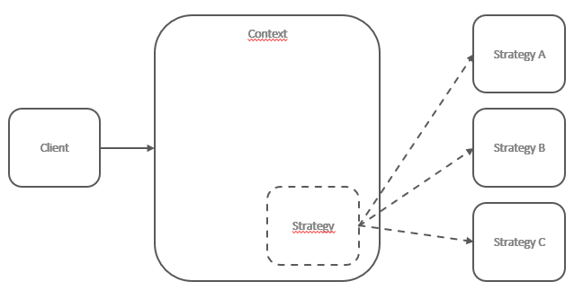
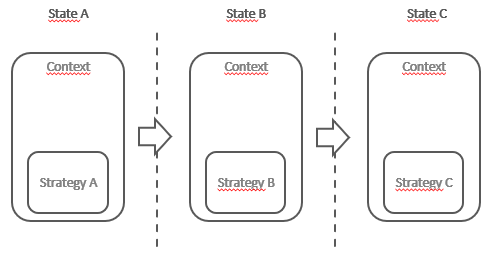
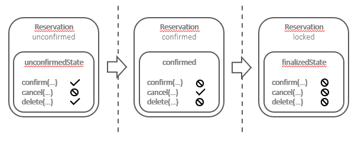
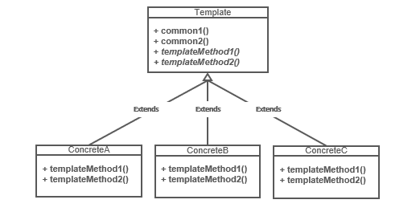
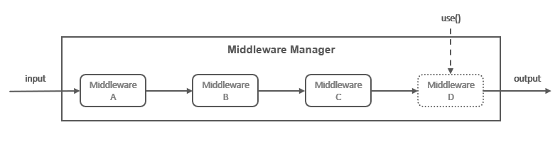
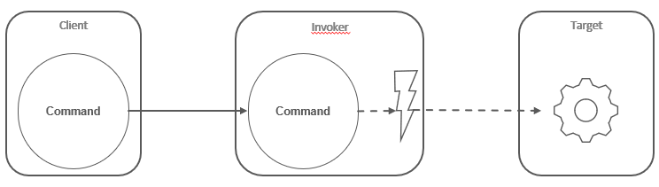

# Part 4: Node.js avanced patterns and techniques
## Chapter 35 &mdash; Behavioral Design Patterns
> Design patterns that deal with how to combine objects and how to define the way they communicate so that the behavior of the resulting structure is extensible, modular, reusable, and adaptable.

### Contents
+ Introduce the set of traditional design patterns that deal with the behavior of components: combining them to define the way they comminicate so that the behavior of the resulting structure becomes extensible, modular, reusable, and adaptable.
+ The **Strategy** pattern &mdash; change parts of a component to adapt it to specific needs.
+ The **State** pattern &mdash; change the behavior of a component based on its state.
+ The **Template** pattern &mdash; reuse the structure of a component to define new ones.
+ The **Iterator** pattern &mdash; provides a common interface to iterate over a collection.
+ The **Middleware** pattern &mdash; define a modular chain of processing steps.
+ The **Command** pattern &mdash; materializes the information required to execute a routine, allowing such information to be easily transferred, stored, and processed.

### Strategy

> The **Strategy** pattern enables an object, called the **context**, to support variations in its logic by extracting the *variable* parts into separate, *interchangeable* objects called **strategies**.

The *context* implements the common logic of a family of algorithms, while a *strategy* implements the mutable parts, allowing the *context* to adapt its behavior depending on different factors, such as an input value, a system configuration, or user preferences.

*Strategies* are usually a part of a family of solutions, and all of them implement the same interface expected by the context:



You can think of a strategy as a replaceable part of a piece of machinery, such as the tyres of a car, which can be easily changed to make the car adaptable to different road conditions.

The *Strategy* pattern let us separate the concerns within a given problem, and enables the solution to have better flexibility to adapt to different variations of the same high-level problem.

The *Strategy* pattern should be used when supporting variations of the behavior involve complex conditional logic, or mixing completely different components of the same family.

Imagine an e-commerce application that provides an `Order` class that represents and online order. It exposes a method `pay()` that finalizes the order and transfer the funds from the end-user to the online store. As the application has to support different payment systems we can:
+ Use an *if..else* statement in the `pay()` method to complete the operation based on the chose payment option.
+ Delegate the logic of the payment to a *strategy* object that implements the logic for the specific payment gateway selected by the user.

Obviously, the second option if far superior as it enables the `Order` object to support a virtually unlimited number of payment methods, and keeps its scope limited to only managing the details of the user, the purchased items, and the price, while delegating the complex task of the payment to another object. By contrast, the first option will require a lot of *if..else* statements, and the code will become unmanageable as the number of payment options grow.

#### Example: Multi-format configuration objects
Let's consider an object called `Config` that holds a set of configuration parameters used by an application. The `Config` object should provide a simple interface to access these parameters, but also a way to import and export the configuration using persistent storage, such as a file. Also, we want to be able to support different formats to store the configuration such as JSON, INI or YAML.

This is a good fit for the *Strategy* pattern: while the part of serializing and deserializing the configuration parameters will change, the part that involves accessing the configuration parameters will stay the same.

```javascript
import { promises as fs } from 'fs';
import objectPath from 'object-path';

export class Config {
  constructor(formatStrategy) {
    this.data = {};
    this.formatStrategy = formatStrategy;
  }

  get(configPath) {
    return objectPath.get(this.data, configPath);
  }

  set(configPath, value) {
    return objectPath.set(this.data, configPath, value);
  }

  async load(filePath) {
    console.log(`INFO: config: Deserializing from ${ filePath }`);
    this.data = this.formatStrategy.deserialize(
      await fs.readFile(filePath, 'utf-8')
    );
  }

  async save(filePath) {
    console.log(`INFO: config: Serializing to ${ filePath }`);
    await fs.writeFile(filePath, this.formatStrategy.serialize(this.data));
  }
}
```

+ In the constructor, we create an instance variable to hold all the configuration data. We also store a reference to the `formatStrategy`, which represents the component that we will use to parse and serialize the data.

+ The `set(...)` and `get(...)` methods represent the part of the component that *do not change* independently of the format. We delegate the access to deep config properties on the `object-path` library which supports a dotted path notation (as in `prop.subProp`).

+ The `load(...)` and `save(...)` methods delegate to the `formatStrategy` the serialization and deserialization of the config data. Therefore, the strategies must expose the `serialize(...)` and `deserialize(...)` methods as those will be invoked from the *context* object.

Let's continue our example, showing how different strategies can be leveraged.

To support JSON configuration we can provide the following module:

```javascript
export const jsonStrategy = {
  deserialize: data => JSON.parse(data),
  serialize: data => JSON.stringify(data)
};
```

And we can provide another module to support [INI](https://en.wikipedia.org/wiki/INI_file) files:

```javascript
import ini from 'ini';

export const iniStrategy = {
  deserialize: data => ini.parse(data),
  serialize: data => ini.stringify(data)
};
```

| NOTE: |
| :---- |
| We are using the NPM module [ini](https://www.npmjs.com/package/ini) to address INI files parsing and serialization. |

Let's wrap up our example by creating a *main* program that leverages the `Config` object with the two different *strategies*:

```javascript
async function main() {
  /* INI */
  const iniConfig = new Config(iniStrategy);
  await iniConfig.load(`samples/conf.ini`);
  console.log(iniConfig.get(`greeting`));
  iniConfig.set('book.nodejs', 'design patterns');
  await iniConfig.save(`samples/conf_mod.ini`);

  /* JSON */
  const jsonConfig = new Config(jsonStrategy);
  await jsonConfig.load(`samples/conf.json`);
  console.log(jsonConfig.get(`greeting`));
  jsonConfig.set('book.nodejs', 'design patterns');
  await jsonConfig.save(`samples/conf_mod.json`);
}
```

| EXAMPLE: |
| :------- |
| See [01 &mdash; *Strategy* pattern](01-strategy-config) for a runnable example. |

The previous example showed us one of the possible alternatives that we had for selecting a strategy, but there are others such as:
+ creating two different strategy families: one specialized in serialization and another in deserialization.
+ dynamically selecting the strategy: we could have implemented a mechanism to dynamically select the strategy based on the extension of the file provided.

It must be also noted that the implementation of the strategy pattern might not require classes at all, and you might find usages of the *Strategy* pattern implemented as:

```javascript
function context(strategy) { ... }
```

#### In the wild
[Passport](https://github.com/jaredhanson/passport) ia a well-known authentication framework for Node.js, which allows a web server to suppoert different authentication schemes. *Passport* uses the *Strategy* pattern to separate the common logic used during authentication process from the parts that change.

### State
The **State** pattern is a specialization of the *Strategy* pattern where the strategy changes depending on the state of the context.

In contrast to the *Strategy* pattern behavior, in which the *strategy* remains unchanged once selected (based on a config property, input parameter...), in the **State** pattern, the strategy, which is called the *state* is dynamic and can change during the lifetime of the *context*, allowing its behavior to adapt depending on its internal state.



The diagram shows how a *context* object transitions through three states (A, B, and C), and how at each different context state, a different strategy is selected.

> The **State** pattern allows a component to adapt its behavior dynamically depending on its internal state.

Let's consider an example consisting of a hotel booking system, and an object called `Reservation` that models a room reservation.
+ When the reservation is created, the user can confirm (using `confirm()`) the reservation. The user cannot cancel it (using `cancel()`) because it's still not confirmed, but they can delete the reservation before confirming it (using `delete()`).
+ Once the reservation is confirmed, the `confirm()` method should throw an exception. However, it should be possible to cancel it. Deleting the reservation should not be allowed for internal housekeeping purposes.
+ On the day before the reservation, the user should not be allowed to either confirm, cancel or delete.

The following diagram depicts the expected behavior in terms of the *State* pattern:



The way to solve this problem is to apply the *State* pattern with three strategies, each one implementing the same interface (`confirm()`, `cancel()`, and `delete()`) with the three different behaviors corresponding to the three states.

The switch from one behavior to another would simply require the activation of a different strategy (state object) on each state change.

| NOTE: |
| :---- |
| The *state transition* can be initiated and controlled by the context object, by client code, or by the *state* object itself. The last option usually provides the best results in terms of flexibility and decoupling, as the context does not have to know about all the possible states and how to transition between them.

#### Implementing a basic failsafe socket
In this section, we we will build a TCP client socket that does not fail when the connection with the server is lost. Instead, we will queue all the data sent during the time in which the server is offline and then try to send it again as soon as the connection is reestablished.

The socket will be leveraged in the context of a simple monitoring system, where a set of machines sends some statistics about the resource utilization at regular intervals. Thus, the failsafe implementation will be useful when the server that collects the statistics goes down, as our socket will queue the data until it becomes available again.

Let's start by creating the *context* object. This is the object that contains the common logic for all the *states*:

```javascript
import { OfflineState } from './states/offline-state.js';
import { OnlineState } from './states/online-state.js';

export class FailsafeSocket {

  constructor(options) {
    this.options = options;
    this.queue = [];
    this.currentState = null;
    this.socket = null;
    this.states = {
      offline: new OfflineState(this),
      online: new OnlineState(this)
    };
    this.changeState('offline');
  }

  changeState(state) {
    console.log(`INFO: FailsafeSocket: Activating state: ${ state }`);
    this.currentState = this.states[state];
    this.currentState.activate();
  }

  send(data) {
    this.currentState.send(data);
  }
}
```

+ The `constructor(...)` initializes the different properties we will need: the queue that will contain the data that cannot be sent, the underlying socket, the object that will reference the two different *states* (online/offline) of the *context*, and a property that references the currently active *state*. We will initialize the `FailsafeSocket` instances as `'offline'`.

+ The `changeState(...)` method is responsible for transitioning from one state to another. It simply switches the `currentState` instance property and invokes `active(...)` on the target *state*.

+ The `send(...)` method is responsible for sending the data. This is the main piece that leverages the different behavior depending on the state, and therefore, we delegate the actual send to the currently active state. Ultimately, the *state* will behave differently if we are in online or offline mode.

As a summary, we know that the *state* will be a class exposing:
+ a constructor to build the *state* instance
+ an `activate(...)` method that will be called to notify the *state* that it is the currently enabled mode on the *context*
+ a `send(...)` method which will be called to either send over a TCP socket/enqueue the data.

Let's have a look at the offline *state* first:

```javascript
import jsonOverTcp from 'json-over-tcp-2';

export class OfflineState {
  constructor(failsafeSocket) {
    this.failsafeSocket = failsafeSocket;
  }

  send(data) {
    this.failsafeSocket.queue.push(data);
  }

  activate() {
    const retry = () => {
      setTimeout(() => this.activate(), 1000);
    };

    console.log(`INFO: OfflineState: Trying to connect...`);
    this.failsafeSocket.socket = jsonOverTcp.connect(
      this.failsafeSocket.options,
      () => {
        console.log(`INFO: OfflineState: Connection established!`);
        this.failsafeSocket.socket.removeListener('error', retry);
        this.failsafeSocket.changeState('online');
      }
    );
    this.failsafeSocket.socket.once('error', retry);
  }
}
```

This is how the offline mode works:

+ We use a library [json-over-tcp-2(jot)](https://www.npmjs.com/package/json-over-tcp-2) that will help with the serialization of JSON objects over TCP.

+ The `send(...)` method in offline mode simply pushes the data received into the *context* queue.

+ The `activate()` method will attempt to connect over TCP using the `json-over-tcp-2` socket. If the operation fails, it will register an scheduled task to retry after one second. If it succeeds, it will *unschedule* the retry task, and transition the *context* state to `'online'`.

Let's have a look now at the online mode implementation:

```javascript
export class OnlineState {
  constructor(failsafeSocket) {
    this.failsafeSocket = failsafeSocket;
    this.hasDisconnected = false;
  }

  send(data) {
    this.failsafeSocket.queue.push(data);
    this._safeWrite(data);
  }

  _safeWrite(data) {
    this.failsafeSocket.socket.write(data, err => {
      if (!this.hasDisconnected && !err) {
        this.failsafeSocket.queue.shift();
      } else {
        const error = this.hasDisconnected ? new Error('Unexpected disconnection') : err;
        this._handleError(error);
      }
    });
  }

  activate() {
    this.hasDisconnected = false;
    for (const data of this.failsafeSocket.queue) {
      this._safeWrite(data);
    }

    this.failsafeSocket.socket.once('error', error => {
      this._handleError(error);
    });
  }

  _handleError(err) {
    console.error(`ERROR: OnlineState: ${ err.message }: switching to offline mode`);
    this.hasDisconnected = true;
    this.failsafeSocket.changeState('offline');
  }
}
```

Thus, in the online mode:

+ `send(...)` queues the data and then immediately tries to write it directly into the socket, as we assume we're online. It performs the actual write using an internal `_safeWrite()` method.

+ `_safeWrite(...)` tries to write the data into the underlying socket (which is *writable stream*). If no errors are returned, and the socket didn't disconnect in the meantime, we assume that the data was sent successfully and therefore we remove it from the queue using `shift()`.

+ `activate()` flushes any data that was queue while the socket was offline, and starts listening for any error event. When this happens, we transition from online to offline mode by directly invoking the *context* object `changeState(...)` method.

| NOTE: |
| :---- |
| The implementation is slightly different for `OnlineState` with regards to the error management, as it was verified that certain error conditions do not trigger the `'error'` event listener. Thus, `_safeWrite(...)` includes an else condition that handles any error received in the callback. |

Now, in order to test it end to end we need a server:

```javascript
import jsonOverTcp from 'json-over-tcp-2';

const server = jsonOverTcp.createServer({ port: 5000 });
server.on('connection', socket => {
  socket.on('data', (data) => {
    console.log(`INFO: server: data received from the client: ${ data }`);
  });
});

server.listen(5000, () => console.log(`INFO: server: TCP server started and listening on port 5000`));
```

And a client that will instantiate a `FailsafeSocket` object to report some metrics:

```javascript
import { FailsafeSocket } from './lib/fail-safe-socket.js';

const failsafeSocket = new FailsafeSocket({ port: 5000 });

setInterval(() => {
  failsafeSocket.send(process.memoryUsage());
}, 2500);
```
| EXAMPLE: |
| :------- |
| See [02 &mdash; *State* pattern: Failsafe socket](02-state-failsafe-socket) for a runnable example. |

### Template

The *Template* pattern has a lot in common with the *Strategy* pattern.

> The **Template** pattern defines an abstract class that implements the skeleton (representing the common parts) of a component, where some of its steps are left undefined. Subclasses can then *fill* the gaps by implementing the missing parts called *template methods*.

The intent of this pattern is to make it possible to define a family of classes that are all variations of a family of components.



The diagram above depicts the structure of the *Template* pattern with three concrete classes that extend the *Template* class and provide an implementation of the abstract methods.

As we don't have abstract classes in JavaScript, we can opt for assigning a function that always throws an exception, or leave the method undefined.

The purpose of the *Template* and *Strategy* pattern is very similar, with the main difference being the way in which the variable parts are wired to the fixed part. While the *Strategy* let us change the variable parts at runtime, with the *Template* the component is determined at development time, when the concrete class is defined, because it uses inheritance.

As a consequence, the *Template* pattern is suitable when you want to create prepackaged variations of a component.

#### A configuration manager template
In this section, we will implement the same example described in the [Strategy](#example-multi-format-configuration-objects) section. We will build an object called `ConfigTemplate` that holds a set of configuration parameters used by an application. The `ConfigTemplate` object should provide a simple interface to access these parameters, but also a way to import and export the configuration using persistent storage, such as a file. Also, we want to be able to support different formats to store the configuration such as JSON, INI or YAML.

```javascript
import { promises as fs } from 'fs';
import objectPath from 'object-path';

export class ConfigTemplate {
  async load(file) {
    console.log(`INFO: ConfigTemplate: Deserializing from ${ file }`);
    this.data = this._deserialize(await fs.readFile(file, 'utf-8'));
  }

  async save(file) {
    console.log(`INFO: ConfigTemplate: Serializing to ${ file }`);
    await fs.writeFile(file, this._serialize(this.data));
  }

  get(path) {
    return objectPath.get(this.data, path);
  }

  set(path, value) {
    return objectPath.set(this.data, path, value);
  }

  _serialize() {
    throw new Error(`_serialize() must be implemented`);
  }

  _deserialize() {
    throw new Error(`_deserialize() must be implemented`);
  }
}
```

The `ConfigTemplate` class implements the common parts of the configuration management logic, namely setting and getting properties, plus the skeleton of the methods for loading and saving the configuration to disk. However, the details for loading and saving are delegated to `_serialize()` and `_deserialized()` which are not implemented. Those are the *templateMethods*, which will allow the creation of concrete classes for dealing with different formats such as JSON, INI, etc.

| NOTE: |
| :---- |
| As there is no support for abstract methods in JavaScript classes, we simply create *stubs* that will throw an exception if directly called. |

Let's now create the concrete class for dealing with JSON config files:

```javascript
import { ConfigTemplate } from './config-template.js';

export class JsonConfig extends ConfigTemplate {

  _deserialize(data) {
    return JSON.parse(data);
  }

  _serialize(data) {
    return JSON.stringify(data, null, ' ');
  }
}
```

And another for dealing with INI format:

```javascript
import { ConfigTemplate } from './config-template.js';
import ini from 'ini';

export class IniConfig extends ConfigTemplate {

  _deserialize(data) {
    return ini.parse(data);
  }

  _serialize(data) {
    return ini.stringify(data, null, ' ');
  }
}
```

And we can test the functionality of the `ConfigTemplate` and its concrete classes with the following code:

```javascript
import { JsonConfig } from './lib/json-config.js';
import { IniConfig } from './lib/ini-config.js';

async function main() {
  /* INI */
  const iniConfig = new IniConfig();
  await iniConfig.load(`samples/conf.ini`);
  console.log(iniConfig.get(`greeting`));
  iniConfig.set('book.nodejs', 'design patterns');
  await iniConfig.save(`samples/conf_mod.ini`);

  /* JSON */
  const jsonConfig = new JsonConfig();
  await jsonConfig.load(`samples/conf.json`);
  console.log(jsonConfig.get(`greeting`));
  jsonConfig.set('book.nodejs', 'design patterns');
  await jsonConfig.save(`samples/conf_mod.json`);
}

main()
  .then(() => console.log(`Done!!!`))
  .catch((err) => console.error(`ERROR: ${ err.message }`));
```

| EXAMPLE: |
| :------- |
| See [03 &mdash; *Template* pattern: Config](03-template-config) for a runnable example. |

Note how the functionality provided by implementation based on the *Strategy* pattern matches exactly the functionality of this example that uses the *Template* pattern.

The difference lies in the fact that when using the *Template* the different behavior is *baked into* the class itself, rather than being chosen at runtime.

#### In the wild
The *Template* pattern is very commonly used in JavaScript when using inheritance. For example, we used it when we were extending different stream classes to implement our custom streams in [Chapter 32: Coding with Streams](../chapter32-coding-with-streams).

### Iterator

The **Iterator** pattern is a fundamental pattern that it is built (in one way or another) into most of the programming languages. It was included in JavaScript in ES2015.

> The **Iterator** pattern defines a common interface to iterate over elements produced or retrieved in sequence, such as the elements of a container (e.g. array or tree data structure), event emitter, or stream. The **Iterator** allows us to decouple the implementation of the traversal algorithm from the way we consume the elements of the traversal operation.

Usually, the algorithm is different depending on the actual structure of the data (think in the different between iterating over an array with a loop or traversing a tree using a more complex tree traversal). The *Iterator* pattern hides the details about the algorithm being used, or the structure or the data and provide a common interface for iterating any type of container.

#### The iterator protocol
In JavaScript, the *Iterator* pattern is implemented through *protocols* rather than through formal constructs such as inheritance.

In practice, this means that the interaction between the implementer and the consumer of the *Iterator* pattern will communicate using interfaces and objects whose shape is agreed in advance.

The starting point for implementing the *Iterator* pattern is the *iterator protocol*, which defines the interface for producing a sequence of values.

> We'll call *iterator* an object implement a `next()` method having the following behavior: each time the method is called, the function returns the next element in the iteration through an object, called the *iterator result* having two properties &mdash; `done` and `value`:

+ `done` is set to true when the iteration is complete. That is, when there are no more elements to return. Otherwise, `done` must be `undefined` or `false`.
+ `value` contains the current element of the iteration and it can be left `undefined` if `done` is `true`. If `value` is set even when `done` is `true`, then it is said that `value` contains the *return value* of the iteration: a value which is not part of the elements being iterated, but that is related to the iteration itself as a whole (e.g. the time spent iterating over the elements, or the average value of the items iterated if those are numbers).

As an example, let's implement the *iterator* protocol on a factory function `createAlphabetIterator()` which creates an iterator that allows us to traverse all the letters of the English alphabet:

```javascript
const A_CHAR_CODE = 65;
const Z_CHAR_CODE = 90;

export function createAlphabetIterator() {
  let currCode = A_CHAR_CODE;

  return {
    next() {
      const currChar = String.fromCodePoint(currCode);
      if (currCode > Z_CHAR_CODE) {
        return { done: true };
      }

      currCode++;
      return { value: currChar, done: false };
    }
  };
}
```

Note how we are following the *iterator protocol* to the letter: at each invocation of the `next()` method we simply increment a number representing the letter's character code, convert it to a character, and then return it using the expect object shape.

| NOTE: |
| :------- |
| Note that it's not a requirement for an iterator to ever return `done: true`. Those iterators are called *infinite*. Examples are iterators that return random numbers or numbers in mathematical series such as Fibonacci. |

Iterators are often stateful objects (as in the example above), as they might need to maintain the current position in the iteration. In the example above it is done using *closures* but there are other ways to do it, such as keeping the state within the iterator itself.

Iterators can also be stateless objects (e.g. *iterator* that returns a random number).

Let's see how we can consume the iterator we have just built:

```javascript
import { createAlphabetIterator } from './lib/alphabet-iterator.js';

const iterator = createAlphabetIterator();

let iterationResult = iterator.next();
while (!iterationResult.done) {
  console.log(iterationResult.value);
  iterationResult = iterator.next();
}
```

| EXAMPLE: |
| :------- |
| See [04 &mdash; *Iterator* pattern: Alphabet traversal](04-iterator-alphabet) for a runnable example. |


Obviously, JavaScript provides much more convenient and elegant ways to consume iterators, but the previous one will work too.

| NOTE: |
| :------- |
| *Iterators* can optionally specify two additional methods: `return([value])` and `throw(error)`. The first is by convention used to signal to the iterator that the consumer has stopped the iteration before its completion, while the second is used to communicate to the *iterator* that an error condition has occurred. Those methods are rarely used by built-in iterators. |

#### The iterable protocol

The *iterable protocol* defines a standardized way for an object to return an iterator. Such object are called *iterables*. Usually, an *iterable* is a container of elements, such as a data structure, but it can also represent a set of elements such as a `Directory` object which would allow us to iterate over the files in a directory.

In JavaScript, we can define an *iterable* by making sure it implements the *@@iterator method*, or in other words, a method accessible through the built-in symbol `Symbol.iterator`.

| NOTE: |
| :------- |
| The *@@name* convention indicates a *well-known* symbol according to the ES6 specification. See [ES6: Well-known symbols](https://262.ecma-international.org/6.0/#sec-well-known-symbols) for more details. |


Such an *@@iterator* method should return an *iterator* object, which can be used to iterate over the elements represented by the *iterable*.

```javascript
class MyIterable {
  ...
  [Symbol.iterator]() {
    /* return an iterator */
  }
}
```

To show how this works, let's build a class that let us traverse a bidimensional matrix:

```javascript
export class Matrix {
  constructor(inMatrix) {
    this.data = inMatrix;
  }

  get(row, column) {
    if (row >= this.data.length || column >= this.data[row].length) {
      throw new RangeError('Out of bounds');
    }
    return this.data[row][column];
  }

  set(row, column, value) {
    if (row >= this.data.length || column >= this.data[row].length) {
      throw new RangeError('Out of bounds');
    }
    this.data[row][column] = value;
  }

  [Symbol.iterator]() {
    let nextRow = 0;
    let nextCol = 0;
    return {
      /* note that `next() : { ... }` will not bind `this` correctly */
      next: () => {
        if (nextRow === this.data.length) {
          return { done: true };
        }

        const currVal = this.data[nextRow][nextCol];
        if (nextCol === this.data[nextRow].length - 1) {
          nextRow++;
          nextCol = 0;
        } else {
          nextCol++;
        }
        return { value: currVal };
      }
    };
  }
}
```

The class contains basic methods for initializing the matrix elements, and also for setting and getting individual elements. On top of that, the class exposes the *@@iterator* method, which implements the *iterable protocol*. The method returns an *iterator* which is compliant with the *iterator* protocol. The *iterator* logic will let us traverse the elements of the matrix in the usual way matrices are traversed.

Let's see our `Matrix` class in action:

```javascript
import { Matrix } from './lib/matrix.js';

const matrix2x2 = new Matrix([
  [1, 2],
  [3, 4]
]);

const iterator = matrix2x2[Symbol.iterator]();
let iterationResult = iterator.next();
while (!iterationResult.done) {
  console.log(iterationResult.value);
  iterationResult = iterator.next();
}
```

| EXAMPLE: |
| :------- |
| See [05 &mdash; *Iterable* protocol: Bidimensional matrix](05-iterable-matrix) for a runnable example. |

Again, there are more convenient and elegant ways to consume iterators, as we will see in the next section.

#### Iterators and iterables as a native JavaScript interface
Having a standardized interface allows 3rd party code, as well as the language itself to be modeled around the two protocols to provide certain capabilities such as native APIs and other syntax constructs.

The most obvious syntax construct accepting an *iterable* is the *for...of* loop, meaning we can simply do:

```javascript
for (const element of matrix2x2) {
  console.log(element);
}
```

But it will also work with the spread operator:

```javascript
const flattenedMatrix = [...matrix2x2];
```

and with destructuring:

```javascript
const [a11, a12, a21, a22] = matrix2x2;
```

Additionally, the following JavaScript built-in APIs accept iterables:
+ `Map([iterable])` &mdash; [MDN: Map constructor](https://developer.mozilla.org/en-US/docs/Web/JavaScript/Reference/Global_Objects/Map/Map)
+ `WeakMap([iterable])` &mdash; [MDN: WeakMap constructor](https://developer.mozilla.org/en-US/docs/Web/JavaScript/Reference/Global_Objects/WeakMap/WeakMap)
+ `Set([iterable])` &mdash; [MDN: Set constructor](https://developer.mozilla.org/en-US/docs/Web/JavaScript/Reference/Global_Objects/Set/Set)
+ `WeakSet([iterable])` &mdash; [MDN: WeakSet constructor](https://developer.mozilla.org/en-US/docs/Web/JavaScript/Reference/Global_Objects/WeakSet/WeakSet)
+ `Promise.all(iterable)` &mdash; [MDN: Promise.all()](https://developer.mozilla.org/en-USdocs/Web/JavaScript/Reference/Global_Objects/Promise/all)
+ `Promise.race(iterable)` &mdash; [MDN: Promise.race()](https://developer.mozilla.org/en-US/docs/Web/JavaScript/Reference/Global_Objects/Promise/race)
+ `Array.from(iterable)` &mdash; [MDN: Array.from()](https://developer.mozilla.org/en-US/docs/Web/JavaScript/Reference/Global_Objects/Array/from)

On the Node.js side, one notable API that accepts iterable is `stream.Readable.from(iterable, [options])`, the method that we used to create a *Readable stream* from an array (see [Node.js: `Readable.from()`](https://nodejs.org/api/stream.html#stream_stream_readable_from_iterable_options)).

Note that this means that we would pass a custom *iterable* like the one we created in the previous section to any of these APIs and it would work in the same way as if we passed a native array.

| EXAMPLE: |
| :------- |
| See [06 &mdash; *Iterable* protocol: Notable APIs](06-iterable-notable-apis) for a runnable example. |

As you can see, all these notable mentions require an *iterable* and not an iterator. A possible solution when you have an *iterator* but would like to use an API that require an *iterable* is to implement the *@@iterator* method in the iterator object itself, which will simply return the iterator object itself:

```javascript
const alphabetIterable = {
  [Symbol.iterator]() {
    return createAlphabetIterator();
  }
};

for (const letter of alphabetIterable) {
  console.log(letter);
}
```

| NOTE: |
| :---- |
| The following line ensures that an array does not contain duplicates: `const uniqArray = Array.from(new Set(arrayWithDuplicates))`. |


#### Generators

*Generators* (also known as *semicoroutines*) were introduced as a syntax construct in ES2015.

There are a generalization of standard functions, in which you can define different entry points instead of a single one: a *generator* can be *suspended* using the `yield` statement, and then resumed at a later point at that point.

That feature makes *generators* well suited to implement *iterators*.

##### Generators in theory

To define a *generator function*, we need to use the `function*` declaration:

```javascript
function* myGenerator() {
  // generator body
}
```

Invoking a generator function will not execute the body immediately. Instead, it will return a *generator object*, which is both an *iterator* and an *iterable*.

Invoking `next()` on the *generator object* will start or resume the execution of the generator until the `yield` instruction is invoked or the generator returns (either implicitly or explicitly).

Within the generator, using the keyword `yield` followed by a value `x` is equivalent to returning `{done: false, value: x}` from the iterator, while returning `x` is equivalent to returning `{done: true, value: x}`.

##### A simple generator function

Let's create a simple iterator that yield two names of fruits and return a season:

```javascript
function* fruitGenerator() {
  yield 'peach';
  yield 'watermelon';
  return 'summer';
}

const fruitGeneratorObj = fruitGenerator();

console.log(fruitGeneratorObj.next()); // { value: 'peach', done: false }
console.log(fruitGeneratorObj.next()); // { value: 'watermelon', done: false }
console.log(fruitGeneratorObj.next()); // { value: 'summer', done: true }

/* extra invocation after iterator in generator object is done */
console.log(fruitGeneratorObj.next()); // { value: undefined, done: true }
```

This works as follows:
+ Invoking the *generator function* returns a *generator object*
+ Invoking `next()` for the first time makes the generator to execute until the first `yield` statement. After that, the generator will be put in *pause* and the client code will receive `{ value: 'peach', done: false }`.
+ Invoking `next()` for the second time makes the generator to resume from the line where it paused until the next `yield`statement. Again, the generator will pause there and client code will receive `{ value: 'peach', done: false }`.
+ Invoking `next()` for the third time will make the generator advance until the `return` statement as there are no more `yield`. The generator will finish there and the client code will receive: `{ value: 'summer', done: true }`.
+ Although no reason to be called again, as we already received the signal that the iterator is done, if we call it again we get: `{ value: undefined, done: true }`.

Since a generator function is both an *iterator* and an *iterable* we can do:

```javascript
for (const fruit of fruitGenerator()) {
  console.log(fruit);
}

const fruits = [...fruitGenerator()];
console.log(fruits);

const [fruitOne, ...other] = fruitGenerator();
console.log(fruitOne);
```

| EXAMPLE: |
| :------- |
| See [07 &mdash; *Generators*](07-generator-fruits) for a runnable example. |

##### Controlling a generator iterator
Generator objects feature more functionalities than standard iterators. In particular, the `next(...)` method of the generator functions accept an argument that is not part of the *iterator protocol*.

That argument will be passed as the return value of the `yield` instruction.

```javascript
function* twoWayGenerator() {
  const what = yield null;
  yield `Hello, ${ what }!`;
}

const twoWay = twoWayGenerator();
twoWay.next();
console.log(twoWay.next('world!')); // 'Hello, world!'
```

Note that the protocol needs a little bit of explanation:
+ The first time the `next()` is called makes the execution body of the generator to move to the first `yield` statement. `null` is returned.
+ When `next('world')` is invoked, the generator resumes from the point it was put in pause, receiving the parameter sent. The execution continues until the next `yield` statement, and this time the statement yields the string which is printed in the console.

Another couple of extra features are the optional `throw()` and `return()` iterator methods.

`throw()` lets you communicate with a generator from the client code by sending an exception that is thrown at the point of the last `yield`. In turn, the generator can *catch* the exception and return the canonical iterator object with the `done` and `value` properties.

```javascript
function* throwTwoWayGenenerator() {
  try {
    const what = yield null;
    yield `Hello, ${ what }!`;
  } catch (err) {
    yield `Error received in the generator: ${ err.message }`;
  }
}

const twoWayException = throwTwoWayGenenerator();
twoWayException.next(); // nothing happens
console.log(twoWayException.throw(new Error('Boom!'))); // { value: 'Error received in the generator: Boom!', done: false }
```

return(arg)` forces the generator to terminate and returns an object `{done: true, value: arg }`.

```javascript
function* returnTwoWayGenenerator() {
  const what = yield null;
  yield `Hello, ${ what }!`;
}

const returnGenerator = returnTwoWayGenenerator();
returnGenerator.next();
console.log(returnGenerator.return('forcing return!'));
```
| EXAMPLE: |
| :------- |
| See [08 &mdash; *Generators*: extra capabilities](08-generator-extra-capabilities) for a runnable example. |

##### How to use generators in place of iterators

Generators are also iterators. This means that generator functions can be used to implement the *@@iterator* method of iterable objects.

```javascript
export class Matrix {
  constructor(inMatrix) {
    this.data = inMatrix;
  }

  *[Symbol.iterator]() {
    let nextRow = 0;
    let nextCol = 0;
    while (nextRow !== this.data.length) {
      yield this.data[nextRow][nextCol];

      if (nextCol === this.data[nextRow].length - 1) {
        nextRow++;
        nextCol = 0;
      } else {
        nextCol++;
      }
    }
  }
}
```

Note that the *@@iterator** has been implemented with a generator function, and that has let us simplify the code a bit:
+ the variables we used to maintain the state are regular local variables (no need for closures). This is possible because when a generator is invoked, its local state is preserved between reentries.
+ We use a standard loop to iterate over the elements of the matrix. This is clearly more readable than returning a `next()` function that implements a single iteration of the loop.

| EXAMPLE: |
| :------- |
| See [09 &mdash; *Generators* in place of *iterators*](09-generator-iterator) for a runnable example. |

In summary, generators are excellent alternatives to writing iterators from scratch, as they improve the readability of the iteration routine while maintaining all of their capabilities.

| NOTE: |
| :---- |
| The *generator delegation* is another example of a JavaScript syntax that accepts an iterable as an argument. The instruction `yield* iterable` can be used within a generator function to yield yield each element of the generator one by one. See [10 &mdash; *Generator delegation*](10-generator-delegation) for an example. |

#### Async iterators
In JavaScript, and especially in Node.js, it's very common to have iterations over items that require an asynchronous operation to be produced.

Examples are:
+ iterating over the requests received by an HTTP server
+ iterating over the results of an SQL query
+ iterating over the elements of a paginated REST API

In those situations, it would be ideal to return a promise from the `next()` method of an iterator, and be able to use the *async/await* construct.

*Async iterators* are iterators returning a promise. Similarly, *async iterables* are objects that implement an *@@asyncIterator* method, that is, a method accesible through the `Symbol.asyncIterator` key, which returns an async iterator.

*Async iterables* can be looped using the *for await...of* syntax, which can only be used inside an async function. That construct let us implement a sequential asynchronous execution flow on top of the *Iterator* pattern.

Essentially, *for await...of* is syntactic sugar for the following loop:

```javascript
const asyncIterator = iterable[Symbol.asyncIterator]();
let iterationResult = await asyncIterator.next();
while (!iterationResult.done) {
  console.log(iterationResult.value);
  iterationResult = await asyncIteratior.next();
}
```

The *for await...of* syntax can also be used to iterate over a simple iterable (and not only async iterables), as an array of promises. It will also work if not all the elements (or none) of the iterator are promises.

As an example, the following code takes a list of URLs as input and allows us to iterate over their availability (up/down).

```javascript
import superagent from 'superagent';

export class CheckUrls {
  constructor(urls) {
    this.urls = urls;
  }

  [Symbol.asyncIterator]() {
    const urlsIterator = this.urls[Symbol.iterator]();

    return {
      async next() {
        const iteratorResult = urlsIterator.next();
        if (iteratorResult.done) {
          return { done: true };
        }

        const url = iteratorResult.value;
        try {
          const checkResult = await superagent
            .head(url)
            .redirects(2);
          return { done: false, value: `${ url } is up, status: ${ checkResult.status }` };
        } catch (err) {
          return { done: false, value: `${ url } is down, error: ${ err.message }` };
        }
      }
    };
  }
}
```

Let's analyze the relevant points from the previous code:
+ The `CheckUrls` constructor takes as input an *iterable* or URLs.
+ In our *@@asyncIterator* method, we obtain the *iterator* for the list of URLs (`this.urls`) by invoking is *@@iterable* method.
+ We return a `next()` function from our *@@asyncIterator*, which is tagged as `async`. This means that it will always returns a promise (as requested by the *async iterable protocol*).
+ In the implementation of the `next()` method, we use the `urlsIterator` to go to the next URL in the list, unless there are no more to probe.
+ For checking the availability of the URL we use the `HEAD` HTTP method and use `await` to asynchronously get the result.


In order to use the recently defined *async iterator* we just have to do:

```javascript
import { CheckUrls } from './lib/check-urls.js';

async function main() {
  const checkUrls = new CheckUrls([
    'https://nodejsdesignpatterns.com',
    'https://example.com',
    'https://this-web-does-not-exist.com'
  ]);

  for await (const status of checkUrls) {
    console.log(status);
  }
}

main();
```

| EXAMPLE: |
| :------- |
| See [11 &mdash; *Async Iterators*: URL checker](11-async-iterator-check-urls) for a runnable example. |


As you can see, the *for await...of* syntax let us iterate over an *async iterable* in a very intuitive way.

| NOTE: |
| :---- |
| Both *for await...of* and *for...of* loop will call the optional `return()` method of the iterator if the loop is prematurely interrupted with a `break`, `return`, or an exception. This can be done to perform any necessary cleanup tasks that would otherwise be performed when the iteration completes. |

#### Async generators
You can define an *async generator function* by prepending the keyword `async` to the generator function definition:

```javascript
async function* asyncGeneratorFunction() {
  // ...async generator function body...
}
```

*Async generators* let you use the `await` instruction within their body and the return value of their `next()` method is a promise that resolves to an object having the canonical `done` and `value` properties. This way, *async generator objects* are also valid *async iterators*. They are also valid async iterables, so they can be used in *for await...of* loops.

Let's reimplement the URL checker from the previous section to demonstrate how the readability of the solution is greatly improved by using *async generator functions*.

```javascript
import superagent from 'superagent';

export class CheckUrls {
  constructor(urls) {
    this.urls = urls;
  }

  async *[Symbol.asyncIterator]() {
    for (const url of this.urls) {
      try {
        const checkResult = await superagent
          .head(url)
          .redirects(2);
        yield `${ url } is up, status: ${ checkResult.status }`;
      } catch (err) {
        yield `${ url } is down, error: ${ err.message }`;
      }
    }
  }
}
```

| EXAMPLE: |
| :------- |
| See [12 &mdash; *Async Generators*: URL checker](12-async-generator-check-urls) for a runnable example. |

Note how the *ugliness* of the [11 &mdash; *Async Iterators*: URL checker](11-async-iterator-check-urls) example is completely gone and readability and conciseness improves when using *async generator functions* to implement *async iterators*.

#### Async iterators and Node.js streams
Node.js streams and *async iterators* are very similar in purpose and behavior. In fact, *async iterators* can be seen as a stream construct, used to process the data of an asynchronous resource composed by several elements, piece by piece.

In turn, `stream.Readable` implements the *@@asyncIterator* method, making it async iterable and giving us the opportunity to use the *for await...of* constructor to read data from a stream.

In the following example, we demonstrate how to read from `stdin` and pipe it into the `split()` transform stream which will emit a new chunk each time it finds a newline character. Then, we iterate over the emitted chunks using a *for await...of* loop:

```javascript
import split from 'split2';

async function main() {
  const stream = process.stdin.pipe(split());

  for await (const line of stream) {
    console.log(`STREAM: ${ line }`);
  }
}


main();
```

| EXAMPLE: |
| :------- |
| See [13 &mdash; *Async Iterators* and Node.js streams](13-async-iterator-streams) for a runnable example. |


As you can see streams and async iterators are closely related and using one or the other greatly depends on the specific use case. When trying to decide which one you should use take into account:
+ streams are *push*-based, meaning that data is pushed into the internal buffers by the stream, and then consumed from the buffers. By contrasts, async iterators are *pull*-based, meaning that data is only retrieved/produced on demand by the consumer.
+ streams are better suited to process binary data since they natively provide internal buffering and backpressure.
+ streams can be composed using `pipe()` and similar methods, while async iterators do not provide any composition method out of the box.

| NOTE: |
| :---- |
| It is possible to iterate over an `EventEmitter` using the utility function `events.on(emitter, eventName)`, which returns all the events matching the specified `eventName`. |

#### In the wild
In many places *async iterators* are gaining popularity over streams.

For example, the packages [`@databases/pg`](https://www.npmjs.com/package/@databases/pg), [`@databases/mysql`](https://www.npmjs.com/package/@databases/mysql) and [`@databases/sqlite`](https://www.npmjs.com/package/@databases/sqlite) provude a function called `queryStream()` which returns an *async iterable* which can be used to easily iterate over the results of a query:

```javascript
for await (const record of db.queryStream(sql`SELECT * FROM my_table`)) {
  /* ...process record... */
}
```

| NOTE: |
| :---- |
| The example above uses *tagged template literals* to create SQL queries. Additional information in tagged templates can be found in [Template literals](https://developer.mozilla.org/en-US/docs/Web/JavaScript/Reference/Template_literals) article on MDN. |

### Middleware

The **Middleware** pattern is one of the most distinctive Node.js patterns. However, it is also one of the terms that tend to create more confusion, as it has nothing to do with what is known as middleware on other contexts such as abstractions over lower-level mechanisms such as memory management, etc.

#### Middleware in Express

[Express](https://expressjs.com/) popularized the term middleware in Node.js and gave it an specific definition:
> A *Middleware* represents a set of services, typically functions, that are organized in a pipeline and are responsible for processing incoming HTTP requests and corresponding responses.

In *Express*, the *Middleware* pattern is an effective strategy for allowing developers to easily create and distribute new features that can be easily added to an application, in a way that let the platform take a minimalist approach.

An *Express middleware* has the following signature:

```javascript
function (req, res, next) { ... }
```

where `req` is the incoming request, `res` is the corresponding response object, and `next` is the callback to be invoked when the current middleware has completed its tasks, and that in turn triggers the next middleware in the pipeline.

Examples of tasks that are typically carried out by Express middleware are:
* Parsing/materializing the body of the request
* Decompressing/Compressing requests and responses
* Producing access logs
* Managing user sessions
* Managing encrypted cookies
* Providing CSRF protection

Note how these tasks are *cross-cutting* concerns in web applications that do not have to do with the actual business logic associated to request processing. Essentially, these tasks are *"software in the middle"*.

#### Middleware as a pattern

The *Middleware* pattern can be considered the Node.js incarnation of the *Chain of Responsibility* and the *Intercepting Filter* design patterns.

In more generic terms, the *Middleware* pattern also represents a processing pipeline, very similar to the one used for steams.

> The *Middleware* pattern is a set of processing units, filters, and handlers, under the form of functions, that are connected to form an asynchronous sequence in order to perform preprocessing and postprocessing of any kind of data.

| NOTE: |
| :---- |
| More information on the *Intercepting Filter* pattern can be be found at https://en.wikipedia.org/wiki/Intercepting_filter_pattern. Information on the *Chain of Responsibility* pattern is available in https://en.wikipedia.org/wiki/Chain-of-responsibility_pattern. |

The following diagram illustrates the components of the *Middleware* pattern:



The most essential component of the pattern is the *Middleware Manager*, which is responsible for organizing and executing the middleware functions. The most important implementation details of the pattern are:
* New middleware can be registered by invoking the `use()` function (whose name is just a convention). Typically, new middleware can only be applied at the end of the pipeline, but that is not an strict rule.
* When new data is received for processing, the registered middleware is invoked in an asynchronous sequential execution flow. Each unit in the pipeline receives the result of the execution of the previous unit as input.
* Each piece of middleware can decide to stop further processing of the data. This can be achieved invoking a special dedicate function to stop processing, or by not invoking the callback, or by propagating an error.
In general, an error situation triggers the execution of another sequence of middleware especially dedicated to handling errors.

There is no strict rule about how data should be processed and propagated in the pipeline, and therefore the following two strategies are available:
+ Augmenting the data received as input with additional properties or functions
+ Maintaining the immutability of the data and always returns fresh objects as the result of processing.


#### Creating a middleware framework for ZeroMQ

As an example to demonstrate the *Middleware* pattern, we will build a middleware framework around the [ZeroMQ](https://zeromq.org/) messaging library.

ZeroMQ provides a simple interface for exchanging atomic messages across the network using a variety of protocols. It is often chosen to build complex distributed systems for how easy it is to build a custom messaging infrastructure based on it its basic set of abstractions.

ZeroMQ only supports strings and binary buffers for the messages. Therefore, any encoding or custom formatting of the data has to be implemented by the users of the library.

In the example, we will build a middleware infrastructure to abstract the preprocessing and postprocessing of the data passing through a ZeroMQ socket, so that we can transparently work with JSON objects and compress those messages over the wire.

##### The Middleware Manager

The first step towards toward building a middleware infrastructure around ZeroMQ is to create a component that is responsible for executing the middleware pipeline when a new message is received or sent &mdash; the *Middleware manager*:

```javascript
export class ZmqMiddlewareManager {
  constructor(socket) {
    this.socket = socket;
    this.inboundMiddleware = [];
    this.outboundMiddleware = [];

    this.handleIncomingMessages()
      .catch(err => console.error(`ERROR: ZmqMiddlewareManager:`, err.message));
  }

  async handleIncomingMessages() {
    for await (const [message] of this.socket) {
      await this
        .executeMiddleware(this.inboundMiddleware, message)
        .catch(err => console.error(`ERROR: ZmqMiddlewareManager: Error while processeing the message`, err));
    }
  }

  async send(message) {
    const finalMessage = await this
      .executeMiddleware(this.outboundMiddleware, message);
    return this.socket.send(finalMessage);
  }

  use(middleware) {
    if (middleware.inbound) {
      this.inboundMiddleware.push(middleware.inbound);
    }
    if (middleware.outbound) {
      this.outboundMiddleware.unshift(middleware.outbound);
    }
  }

  async executeMiddleware(middlewares, initialMessage) {
    let message = initialMessage;
    for await (const middlewareFunc of middlewares) {
      message = await middlewareFunc.call(this, message);
    }
    return message;
  }
}
```

Let's go over the implementation details:

+ We define the constructor that accepts a ZeroMQ socket as an argument. Inside the constructor, we create two empty lists that will contain our middleware functions, one for inbound messages (the ones we receive), and another one for the outbound messages (the ones we send). Right after that we immediately start processing the messages coming from the socket using the `handleIncomingMessages()` method.

+ In `handleIncomingMessages()` method, we use the ZeroMQ socket as an *async iterable*, and with a *for...await of* loop we process any incoming messages and passed them down one by one to the `inboundMiddleware` list of middlewares.

+ In `send()` method, we do the same thing but four outbound messages. Effectively, we pass the message received as argument down the `outboundMiddleware` pipeline. The result of the processing is stored in the `finalMessage` variable, and then sent throuvh the socket.

+ In `use()` method we give the client code the capability to append middleware functions to the internal pipeline. Note that in this implementation each middleware to register contains two properties `inbound` and `outbound` to append middleware to the list of inbound and outbound middleware respectively. Note that while the inbound middleware is pushed to the end of the list using `push()`, the outbound middleware is inserted in the beginning of the list using `shift()`. This is because in general, complementaty inbound/outbound middleware functions need to be executed in inverted order. For example, if you want to serialize, encrypt and compress an outbound message, it means you will want to decompress, decrypt and deserialize inbound messages.

+ `executeMiddleware(...)` represents the core of our *Middleware manager* as its responsibility consists in executing the middleware functions. Each function is the `middleware` array received as input is executed one after the other, and the result of the execution of a middleware function is passed to the next. Note that we are using `await` on each result returned by each middleware function to ensure that it works well both for middleware return values synchronously or promises asynchronously. Finally, the result of the last middleware function is returned back to the caller.

| NOTE: |
| :---- |
| The example does not support error handling middleware, but it can be easily added just by accepting an extra `errorMiddleware` function when registering the middleware, and keeping track of those in the *Middleware manager*. |


##### Implementing the middleware to process messages

With the *Middleware Manager* in place, we can create our first pair of middleware functions to demonstrate how to process inbound and outbound messages.

Let's start by creating a simple middleware that deserializes input messages and serializes outbound JSON messages:

```javascript
export const jsonMiddleware = function () {
  return {
    inbound(message) {
      return JSON.parse(message.toString());
    },
    outbound(message) {
      return Buffer.from(JSON.stringify(message));
    }
  };
};
```

We create a function that return a literal object with two functions that implement the deserialization of messages with `JSON.parse(...)` and the serialization of outbound messages with `JSON.stringify()`. Before sending the message, we also wrap the serialized JSON message into a *buffer*.

| NOTE: |
| :---- |
| `jsonMiddleware` functions are synchronous. |

Similarly, let's implement the compression middleware using `zlib`.

```javascript
import { inflateRaw, deflateRaw } from 'zlib';
import { promisify } from 'util';

const inflateRawAsync = promisify(inflateRaw);
const deflateRawAsync = promisify(deflateRaw);

export const zlibMiddleware = function () {
  return {
    inbound(message) {
      return inflateRawAsync(Buffer.from(message));
    },
    outbound(message) {
      return deflateRawAsync(message);
    }
  };
};
```

In this case, we return a literal object that returns two asynchronous functions. As we made sure that our *Middleware manager* is able to handle both synchronous and asynchronous middleware functions.

##### Using the ZeroMQ middleware framework
We will build a very simple distributed application based on *ZeroMQ*. The client will be sending a *ping* to a server, which will echo back the message received.

The strategy we will use is the *Request/Reply messaging pattern* using the *req/rep* socket pair provided by *ZeroMQ*. We will then wrap the sockets with our `ZmqMiddlewareManager` to get all the advantages from the middleware infrastructure that we build.

##### The server
Let's start by implementing the server-side of the application:

```javascript
import zeromq from 'zeromq';
import { ZmqMiddlewareManager } from './lib/zmq-middleware-manager.js';
import { jsonMiddleware } from './lib/middlewares/json-middleware.js';
import { zlibMiddleware } from './lib/middlewares/zlib-middleware.js';

async function main() {
  const socket = new zeromq.Reply();
  await socket.bind('tcp://127.0.0.1:5000');

  const zmqm = new ZmqMiddlewareManager(socket);
  zmqm.use(zlibMiddleware());
  zmqm.use(jsonMiddleware());
  zmqm.use({
    async inbound(message) {
      console.log(`INFO: server: Received: `, message);
      if (message.action === 'ping') {
        await this.send({ action: 'pong', echo: message.echo });
      }
      return message;
    }
  });

  console.log(`INFO: server started on tcp://127.0.0.1:5000`);
}

main()
  .catch((err) => console.log(`ERROR: server: ${ err.message }`));
```

+ We create a new *ZeroMQ* `Reply` socket and bind it to port 5000 on localhost.
+ We wrap *ZeroMQ* with our middleware manager and add the *zlib* and *json* middlewares. Order is important here, and we register the *zlib* middleware first, and then the *json* one which will have the effect of:
  + inbound: uncompress first, then deserialize
  + outbound: serialize first, then compress
+ We implement the *ping* functionality also as a middleware that only includes logic for the inbound messages. When we receive a message, we inspect its contents, and if it is a ping message we send the echo back. In any case, we return the message so that other middlewares could process it.


##### The client
Let's implement now the client side:

```javascript
import zeromq from 'zeromq';
import { ZmqMiddlewareManager } from './lib/zmq-middleware-manager.js';
import { jsonMiddleware } from './lib/middlewares/json-middleware.js';
import { zlibMiddleware } from './lib/middlewares/zlib-middleware.js';

async function main() {
  const socket = new zeromq.Request();
  await socket.connect('tcp://127.0.0.1:5000');

  const zmqm = new ZmqMiddlewareManager(socket);
  zmqm.use(zlibMiddleware());
  zmqm.use(jsonMiddleware());
  zmqm.use({
    inbound(message) {
      console.log(`INFO: client: echoed back: `, message);
      return message;
    }
  });


  setInterval(() => {
    zmqm.send({ action: 'ping', echo: Date.now() })
      .catch(err => console.error(`ERROR: client: ${ err.message }`));
  }, 1000);

  console.log(`INFO: client: connected to tcp://127.0.0.1:5000`);
}

main()
  .catch(err => console.error(`ERROR: client: ${ err.message }`));
```

The most relevant areas around the client implementation are:
+ We create a `Request` socket and we connect to the server address.
+ We configure the *zlib* and *json* middleware in that specific order, so that messages we sent are first serialized and then compressed and messages received are first uncompressed and then deserialized.
+ We set up manually an additional inbound middleware to display in the console the message received from the server.
+ We set up a scheduled task to send pings to the server every second.

| EXAMPLE: |
| :------- |
| See [14 &mdash; *Middleware Pattern*](14-middleware-zmq) for a runnable example. |

#### In the wild

[Express](https://expressjs.com/) is the most notable example of a library that makes an extensive use of the *Middleware pattern*.

[Koa](https://koajs.com/) is another example that shares the same philosophy as Express with respect to the *Middleware pattern*, but uses a more modern approach to its handlings (async/await, etc.)

[Middy](https://middy.js.org/) is another notable example of the *Middleware* pattern enabled to support this pattern when writing AWS Lambda functions.

### Command

In its most generic form, the **Command pattern** is an object that encapsulates the necessary information to perform an action at a later time.

> A *Command* is an object representing the intention to perform a method invocation. The actual invocation, which will happen at a later time, is delegated to another component.

The pattern is built around four major components:




+ **Command** is the object encapsulating the information necessary to invoke a method or function.
+ **Client** is the component that creates the command and provides it to the *invoker*.
+ **Invoker** is the component responsible for executing the command on the target.
+ **Target (or receiver)** is the subject of the invocation. It can be a standalone function or a method of an object.

| NOTE: |
| :---- |
| The implementation of the four components depend a lot on the way we want to implement the pattern. |

The common use cases for the *Command* pattern are:
+ schedule a command to be executed at a later time.
+ serialize a command to be sent over the network (to distribute jobs across remote machines, transmit commands from the browser to the server, RPC...).
+ keep a history of all the operations executed on a system.
+ Commands are an important part of some algorithms for data synchronization and conflict resolution.
+ Commands scheduled for execution at a later time are subject of being canceled. They are also useful to be reverted, brining the state of the application to the point before the command was executed.
+ Commands can be grouped together to create *atomic transactions* or to implement a mechanism whereby all the operations in the group are executed at the same time.
+ Different kinds of transformations can be performed on a set of commands such as duplicate removal, joining, splitting, or applying complex algorithms such as *operational transformation (OT)*, which is the base for today's real-time collaboration software, such as collaborative text editing.

#### The *Task* pattern

As described before, there are several ways to implement the *Command* pattern, with the **Task** pattern being the most basic and trivial implementation.

In order to represent an object representing a potential invocation of a standalone method or function is to use a *closure* around a function definition or *bound function*:

```javascript
function createTask(target, ...args) {
  return () => {
    target(...args);
  };
}
```

which can be written most of the times as:

```javascript
const task = target.bind(null, ...args);
```

| NOTE: |
| :---- |
| We have already used this pattern quite a few times already to schedule and control the execution of tasks. |

| EXAMPLE: |
| :------- |
| See [15 &mdash; *Command Pattern*: simple Task](15-command-task) for a runnable for this approach. |

#### A more complex *Command*
If we want to do more than just wrapping a method invocation for later invocation we need to do a more complex implementation of the *Command* pattern.

In particular, let's suppose we want to support serialization and *undo* capabilities.

We will begin with the implementation of the *target* component (the one we want to invoke through a *command*). This will be *status update service* that can receive messages in a Twitter-like fashion:

```javascript
const statusUpdates = new Map();

export const statusUpdateService = {
  postUpdate(status) {
    const id = Math.floor(Math.random() * 1000000);
    statusUpdates.set(id, status);
    console.log(`Status posted: ${ status } with id=${ id }`);
    return id;
  },
  destroyUpdate(id) {
    statusUpdates.delete(id);
    console.log(`Status removed: ${ id }`);
  }
};
```

Now, let's implement a factory function that creates a *command* to represent the posting of a new status update:

```javascript
export function createPostStatusCmd(service, status) {
  let postId = null;

  // The Command
  return {
    run() {
      postId = service.postUpdate(status);
    },
    undo() {
      if (postId) {
        service.destroyUpdate(postId);
        postId = null;
      }
    },
    serialize() {
      return { type: 'status', action: 'post', status: status };
    }
  };
}
```

The preceding code is a *factory* that produces commands to model "*post status*" intentions.

Each command implements the following three functionalities:

+ A `run()` method that when invoked will trigger the action. The action consists in posting a new status update in the target service.

+ An `undo()` method that reverts the effects of the post operation. This will consists of invoking `destroyUpdate()` on the target service.

+ A `serialize()` method that builds a JavaScript object subject of being serialized, and that would let us reconstruct the original *command object.*


Now, we can build the *invoker*.

```javascript
import superagent, { serialize } from 'superagent';

// The Invoker
export class Invoker {
  constructor() {
    this.history = [];
  }

  run(cmd) {
    this.history.push(cmd);
    cmd.run();
    console.log('Command executed:', cmd.serialize());
  }

  delay(cmd, delay) {
    setTimeout(() => {
      console.log(`Scheduling command for delayed execution: `, cmd.serialize());
      this.run(cmd);
    }, delay);
  }

  undo() {
    const cmd = this.history.pop();
    cmd.undo();
    console.log(`Command undone: `, cmd.serialize());
  }

  async runRemotely(cmd) {
    await superagent
      .post('http://localhost:3000/cmd')
      .send({ json: cmd.serialize() });

    console.log(`Command executed remotely:`, cmd.serialize());
  }
}
```

+ The `run(...)` method is the basic functionality of our *Invoker*. It is responsible for saving the command into the `history` instance variable and then triggering the execution of the command using `cmd.run()`. `cmd.serialize()` is used to display the information in the console.

+ The `delay(...)` method adds a new functionality that consists in scheduling the execution of the command for a later time.

+ The `undo(...)` command reverts the latest command.

+ `runRemotely(...)` allows the execution of the command on a remote server that is listening for commands at `http://localhost:3000/cmd`.


Now, we can implement the *client* from the *Command* pattern perspective, that uses the capabilities exposed from the *Invoker*:

```javascript
import { createPostStatusCmd } from './lib/create-post-status-cmd.js';
import { statusUpdateService } from './lib/status-update-service.js';
import { Invoker } from './lib/invoker.js';

const invoker = new Invoker();

const command = createPostStatusCmd(statusUpdateService, 'Hi!');

// Execute immediately, using the command
invoker.run(command);

// Revert
invoker.undo(command);

// Schedule the message to be executed in 2 seconds from now
invoker.delay(command, 2000);

// Run the command on a remote server
invoker.runRemotely(command);
```

And we can also very easily implement a remote server that receives the command in the body of the HTTP request and process it:

```javascript
import http from 'http';
import { createPostStatusCmd } from './lib/create-post-status-cmd.js';
import { statusUpdateService } from './lib/status-update-service.js';
import { Invoker } from './lib/invoker.js';


const server = http.createServer((req, res) => {
  if (req.method === 'POST' && req.url === '/cmd') {
    let requestBody = '';
    req
      .on('data', (chunk) => {
        requestBody += chunk.toString();
      })
      .on('end', () => {
        let statusMessage;
        try {
          statusMessage = JSON.parse(requestBody)?.json?.status;
        } catch (err) {
          res
            .writeHead(400, 'Unrecognized format')
            .end();
        }

        try {
          const invoker = new Invoker();
          const command = createPostStatusCmd(statusUpdateService, statusMessage);
          invoker.run(command);
          res
            .writeHead('200')
            .end();

        } catch (err) {
          res
            .writeHead(500, 'Could not post status received remotely')
            .end();
        }
      });
  } else {
    res.writeHead(404);
    res.end();
  }
});

server.listen(3000, () => {
  console.log(`INFO: remote-server: Server listening on port 3000`);
});
```
| EXAMPLE: |
| :------- |
| See [16 &mdash; *Command Pattern*: complex use case](16-command-complex) for a runnable example. |

Please be aware of how much additional code we had to add to wrap a simple method invocation into a method. As a general guideline, a full-fledge implementation of the *Command* pattern should be used only when strictly needed. In most of the cases, the simpler *Task* pattern will suffice.


### You know you've mastered this chapter when...

+ You are aware that the *Strategy*, the *State*, and the *Template* patterns are closely related.

+ You're comfortable identifying the *Strategy* pattern as the one whole lets you extract the common parts of a family of closely related components into a component called the *context* which allows us to define different *strategy* objects to implement specific behaviors.

+ You understand that the *State* pattern is a variation of the *Strategy* pattern where the strategies are used to model the behavior of a component under different states.

+ You are aware that the *Template* pattern is the *static* version of the *Strategy* pattern, as the different behaviors are implemented using inheritance and therefore, cannot be changed dynamically.

+ You understand that the *Iterator* pattern defines a common interface to iterate over the elements produced or retrieved in sequence, such as the elements of a container, event emitter, or a stream.

+ You understand that the *Iterator* pattern in JavaScript is implemented as a protocol rather than using inheritance: an *iterator* in JavaScript is an object that implements a method `next()` that each time that it is called return the next eelement in the iteration wrapped in an object with two properties: `done` and `value`.

+ You are aware of the `return([value])` and `throw(error)` optional methods that you can find in iterators to signal that the iteration has finished before its completion or that an error has been found while iterating (respectively).

+ You're familiar with the *iterable* protocol, that defines a standard way for an object to return an iterator. An *iterable* object is an object that implements such standard method that return an iterator and it is denoted as *@@iterator*.
  + You understand that the syntax *@@name* denotes a well-known ES6 symbol and it is the same as `Symbol.name`.
  + The *@@iterator* method that should return an iterator object can be accessed as `Symbol.iterator`, which means that an iterable should define a method denoted as `[Symbol.iterator]() { ...returns an iterator... }`

+ You're comfortable using the native JavaScript interfaces to interact with *iterables*:
  + *for...of* loops
  + The *spread* operator: `[...iterable]`
  + Destructuring: `const [elem1, elem2, ...rest] = iterable`

+ You're aware of the different JavaScript and Node.js built-in APIs that accept iterables.

+ You're comfortable with the concept of *generators*:
  + you're familiar with their syntax: `function* genFunc() { ... }`
  + you understand that calling a generator function returns a generator object that exposes a `next()` method
  + you understand the logic of pausing/resuming using `yield`
  + you understand that returning from a generator function finishes the iteration
  + You are aware that the `next()` function of generators provide extra functionality like accepting parameters to build *two-way* generators that communicate with the client code
  + You are aware that the generator functions also expose a `throw()` and `return()` methods so that the client code can communicate errors found while using the generator or that the iteration has completed before reaching the `return`.

+ You understand that *async iterators* are needed to iterate over *containers* that return elements asynchronously, such as HTTP servers, SQL queries, etc.

+ You understand that *async iterators* are iterators that return a promise, and that *async iterables* are objects that return an iterator through the *@@asyncIterator* method.

+ You're comfortable using the *for await...of* construct to interact with *async iterables*.

+ You're comfortable with the concept of *async generators* and its syntax.

+ You're aware that *async iterators* and *stream* are very similar concepts in purpose and behavior and know the rules that dictate which one to use:
  + streams are *push-based* (data is pushed into the internal buffer of the stream, and then consumed by the client code from the buffer), while async iterators are *pull-based* (data is only produced on demand by the consumer of the async iterator).
  + streams excel when dealing with binary data and backpressure management
  + streams can be composed
  + async iterators are very easy to reason with

+ You are comfortable using JavaScript *Iterators* in Node.js and understand the *iterable* and *iterator* protocols. You are also comfortable with *generator functions* and understand how much they simplify the implementation of the *iterator* protocol.

+ You are comfortable using *async iterators* and are familiar with the *for...await of* construct. You recognize the use cases on which they apply. You are also familiar with the concept of *async generator functions* and how they help in the implementation of *async iterators*.

+ You're comfortable with the *Middleware* pattern, very distinctive of the Node.js ecosystem. You are familiar with their components and their use and implementation.

+ You understand the *Command* pattern and the use cases on which it can be applied. You understand how easy can be implemented with the *Task* pattern, and how the *Command* pattern can be implemented more thoroughly where needed to support pretty advanced use cases.

### Patterns Cheat Sheet

| Type | Pattern | Definition | Example | Additional info |
|:---- | :------ | :--------- | :------ | :-------------- |
| Creational | [**Factory**](#factory) | Allows you to separate the creation of an object from its implementation | `const db = createDb(dbName)` | As it decouples the creation of the object from the implementation, lets you create an object whose class is actually determined at runtime.<br>Also, using the *Factory* pattern reduces the exposed surface area when compared to exposing the class, thus providing better encapsulation and information hiding. <br>Protects consumer code against changes on the classes it leverages. |
| Creational | [**Builder**](#builder) | Simplifies the creation (or invocation) of complex objects (or functions) by providing a fluent interface which which allows you to build (or invoke) the object (or function) step by step. | `const db = new Db().setName(dbName).build()` |Greatly simplifies *DX*, as the fluent interface is simple to read and self-documenting.<br>The implementation consists in encapsulating parameter setting related login into setter methods. |
| Creational | [**Revealing Constructor**](#revealing-constructor) | Expose certain private functionality of an object to the consumer only at the time of creation, making them completely inaccessible once the object is created. | `const db = new Database((dbConfig) => {...})` | The pattern consists in defining a constructor which accepts as argument a function that will receive the private properties that will be accessible during creation.<br>This pattern provides strong guarantees regarding encapsulation and information hiding. |
| Creational | [**Singleton**](#singleton) | Enforces the presence of only once instance of a class and centralizes access to it. | `export const db = new Database(dbName)` |This pattern are great for sharing stateful information and synchronizing access to a resources.<br>You must be aware that multiple incompatible versions of a module might end up creating multiple *singleton instances* (one per incompatible version). |
| Dependency Wiring | [**Singleton dependencies**](#singleton-dependencies) | Leverages the module system to provide the dependencies of a  module as *Singletons*, which ensures the correct wiring even for stateful dependencies. | `import { db } from 'db.js'` | Very simple to implement, but creates tight coupling between a module and its dependencies. |
| Dependency Wiring | [**Dependency Injection**](#dependency-injection) | The dependencies of a component are *provided as inputs* by an external entity. | `const blog = new Blog(db)` | Provides loose coupling between components at the cost of more complex implementation and dependency graph management. |
| Structural | [**Proxy**](#proxy) | Contols access to another object, called the *subject*, by providing an object with the same interface as the *subject* that intercepts all or some of the operations that are meant to be executed on the *subject*, augmenting or complementing its behavior. | `const proxy = new EnhancedSubject(subject)` | Several techniques available for implementing it: composition, monkey-patching and native `Proxy` object. |
| Structural | [**Change Observer**](#change-observer-pattern-with-proxy) | Variant of [**Proxy**](#proxy) in which the *subject* notifies one or more observers of any state change in the object so that they can react to them as soon as they occur. | `const observableSubject = createObservable(subject, (...args) => { /* listener logic */ })` | Cornerstone of reactive programming |
| Structural | [**Decorator**](#decorator) | Dynamically augment the behavior of an existing *target* object. | Same impelementation techniques available for the *Proxy* pattern can be applied to *Decorator*. |
| Structural | [**Adapter**](#adapter) | Takes the interface on an object (the *adaptee*) and makes it compatible with another interface that is expected by the client code. | `const adapter = createAdapter(adaptee)` | It is common to find that methods exposed from the *Adapter* ends up invoking several methods in the *adaptee*. |
| Behavioral | [**Strategy**](#strategy) | Enables an object (the *context*), to support variations in its logic by extracting the variable parts into separate interchangeable objects called *strategies*. | `const context = new Context(activeStrategy)` | Strategies are usually a part of a family of solutions, all of them implementing the same interface. |
| Behavioral | [**State**](#state) | Allows a component to adapt its behavior dynamically depending on its internal state | n/a | Specialization of the *Strategy* pattern where the strategy changes automatically depending on the state of the context. |
| Behavioral | [**Template**](#template) | Defines an abstract class that implements the skeleton (representing the common parts) of a component, where some of its steps are left undefined. Subclasses can then fill the gaps by implementing the missing parts known as *template methods*. | n/a | The difference between the *Template* and the *Strategy* pattern is that in the *Template* the different behavior is *baked into* the class itself, rather than chosen at runtime. |
| Behavioral | [**Iterator**](#Iterator) | Defines a common interface to iterate over elements produced or retrieved in sequence, such as the elements of a container (e.g. array or tree data structure), so that the implementation of the traversal algorithm is decoupled from the way in which the elements of the traversal operation are consumed. | `function createIter() { return { next() { ... } }; }` | In JavaScript the *Iterator* pattern is implemented through a protocol: an *iterator* is an object that implements a `next()` method that each time that the method is called returns the next element in the iteration wrapped in an object with the properties `done` and `value`.  |
| Behavioral | [**Async Iterator**](#async-iterator) | An *Async Iterator* is an *iterator* that returns a promise through its `next()` function. | n/a | Async iterators can be looped using *for await...of* syntax. |
| Middleware | [**Middleware**](#middleware) | Represents a set of services, typically functions that are organized in a pipeline and are responsible for processing incoming HTTP requests and corresponding responses. | `function (req, res, next) { ... }` | The most essential component of the pattern is the *Middleware Manager*, responsible for organizing and executing the middleware functions. |
| Behavioral | [**Command**](#command) | Object representing the intention to perform a method invocation. The actual invocation, which will happen at a later time, is delegated to another component different from the one that created the *command* object. | const task = target.bind(null, ...args); | In its simplest form, a *closure* or a *bound function* serves as a valid implementation. If more sophisticated functionality is needed, the code can become quite complex to simply wrap a method invocation. |

### Code, Exercises and mini-projects

#### [01 &mdash; *Strategy* pattern](01-strategy-config)
Illustrates how to implement the *Strategy* pattern by creating a config that supports different types of formats.

#### [02 &mdash; *State* pattern: Failsafe socket](02-state-failsafe-socket)
Illustrates how to implement the *State* pattern by creating Failsafe socket implementation that handles gracefully disruption in the communication as two states.

#### [03 &mdash; *Template* pattern: Config](03-template-config)
Illustrates how to implement the *Template* pattern by creating a configuration object that supports different types of formats (JSON, INI, ...).

#### [04 &mdash; *Iterator* pattern: Alphabet traversal](04-iterator-alphabet)
Illustrates how to implement the *iterator protocol* by creating a function that creates an *Iterator* that allows us to traverse all the letters of the English alphabet.

#### [05 &mdash; *Iterable* protocol: Bidimensional matrix](05-iterable-matrix)
Illustrates how to implement the *iterable protocol* by creating a class that let us manage the elements of a bidimensional matrix.

#### [06 &mdash; *Iterable* protocol: Notable APIs](06-iterable-notable-apis)
Illustrates how you can pass custom *iterables* to native JavaScript and Node.js APIs that accept *iterables*.

#### [07 &mdash; *Generators*](07-generator-fruits)
Simple example that illustrates how to create a generator function that yields two fruit names and returns their ripening season.

#### [08 &mdash; *Generators*: extra capabilities](08-generator-extra-capabilities)
Illustrates the extra bidirectional capabilities present in generators that are not available in *iterators*: passing values in `next()` and the `throw()` and `return()` methods.

#### [09 &mdash; *Generators* in place of *iterators*](09-generator-iterator)
Illustrates how to use a *generator* function in place of an iterator.

#### [10 &mdash; *Generator delegation*](10-generator-delegation)
Illustrates the *generator delegation* syntax that allows a generator to use `yield* iterable` to delegate to another iterable within a generator function.

#### [11 &mdash; *Async Iterators*: URL checker](11-async-iterator-check-urls)
Illustrates the how to build and use *async iterators* by creating an example that takes a list of URLs as input and iterates over their availability.

#### [12 &mdash; *Async Generators*: URL checker](12-async-generator-check-urls)
Illustrates the how to build an *async generator function*. In the example, we create an app that takes a list of URLs as input and iterates over their availability.

#### [13 &mdash; *Async Iterators* and Node.js streams](13-async-iterator-streams)
Illustrates how to take advantage of the fact that Node.js `stream.Readable` implements *@@asyncIterator** method.

#### [14 &mdash; *Middleware Pattern*](14-middleware-zmq)
Illustrates how to create a middleware infrastructure (from scratch) for *ZeroMQ* framework

#### [15 &mdash; *Command Pattern*: simple Task](15-command-task)
Illustrates the easiest and most basic implementation of the *Command* pattern consisting in creating an object that represents an invocation with a *closure* or using `Function.prototype.bind(...)`.

#### [16 &mdash; *Command Pattern*: complex use case](16-command-complex)
Illustrates a more complex use case involving the *Command pattern* in which we use the pattern to support advanced techniques such as *undo*, *serialization* and *remote execution*.

#### Exercise 1: [Logging with *Strategy*](./e01-strategy-logging/)
Implement a logging component having the methods: `debug()`, `info()`, `warn()`, and `error()`. The logging component should also accept a strategy that defines where the log messages are sent. For example, we might have a `ConsoleStrategy` to send the messages to the console, a `FileStrategy` to send the messages to a file, and a `RemoteStrategy` to send the messages to a remote server through HTTP requests.


### ToDo

[ ] Explore how to iterate over an `EventEmitter` using `events.on(emitter, eventName)`.

[ ] Learn about tagged template literals https://developer.mozilla.org/en-US/docs/Web/JavaScript/Reference/Template_literals

[ ] Give a try to @databases/* drivers: https://www.atdatabases.org/

[ ] Explore Operational Transformation http://nodejsdp.link/operational-transformation